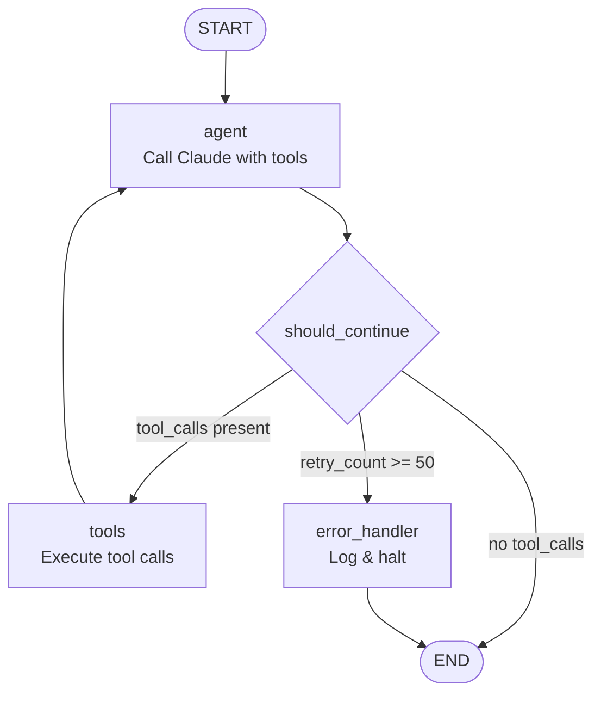
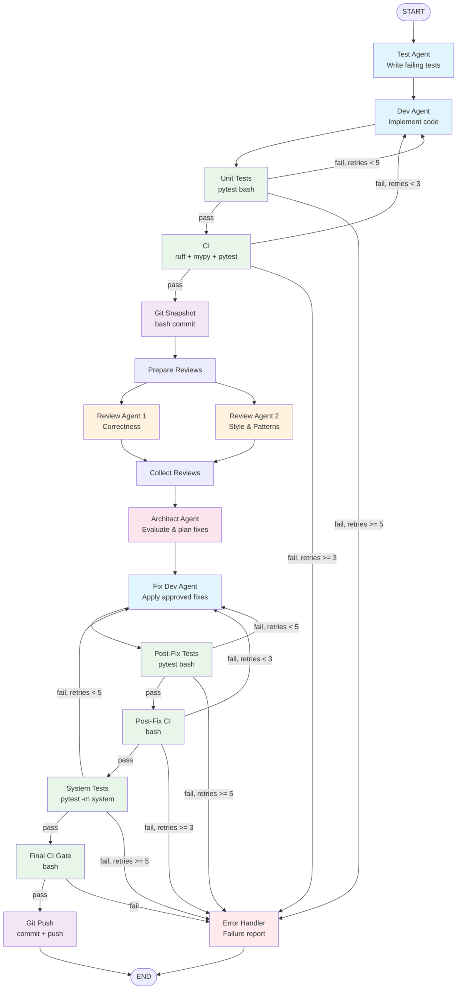

# CODEAGENT.md — Shipyard

**Submission Tier:** MVP

## Agent Architecture (MVP)

### Overview

Shipyard is an autonomous coding agent built on **LangGraph** (Python) with **Claude** via the Anthropic SDK (`langchain-anthropic`). It runs as a persistent process — either a FastAPI server (`POST /instruct`) or an interactive CLI loop — accepting instructions continuously without restarting. State is checkpointed to SQLite after every graph node, enabling session resumption across restarts.

### Core Loop Design

The agent uses a custom **`StateGraph`** with two primary nodes in a ReAct (Reason + Act) pattern:

```
START → agent_node → should_continue → tool_node → agent_node → ... → END
```

- **`agent_node`**: Calls Claude with the system prompt + accumulated messages. Returns an AI message that may contain tool calls.
- **`tool_node`**: Executes all tool calls from the last AI message. Returns `ToolMessage` results.
- **`should_continue`** (conditional edge): If `retry_count >= 50`, route to `error_handler`. If the AI message contains `tool_calls`, route to `tool_node`. Otherwise, route to `END`.

The loop continues until Claude responds without requesting any tool calls — meaning it has completed the task or is reporting a final answer.



### State Schema

```python
class AgentState(MessagesState):
    task_id: str                                    # Unique task identifier
    retry_count: int                                # Current retry count for circuit breaking
    current_phase: str                              # "test" | "implementation" | "review" | "architect" | "fix" | "ci" | "post_fix_test" | "post_fix_ci"
    agent_role: str                                 # "dev" | "test" | "reviewer" | "architect" | "fix_dev"
    files_modified: Annotated[list[str], operator.add]  # Accumulated list of modified file paths
```

State fields beyond `messages` enable conditional routing (e.g., `retry_count > 3` → error handler), trace metadata, and audit logging without parsing message history.

### Entry and Exit Conditions

**Entry (normal run):**
- User sends instruction via `POST /instruct` or CLI input
- `AgentState` is initialized with the instruction as a `HumanMessage`
- Config includes `thread_id` for session persistence and metadata for tracing

**Exit (normal):**
- Claude responds without tool calls → graph reaches `END`
- Response returned to user

**Exit (error):**
- Global turn cap (50 LLM turns) exceeded → error handler logs report, halts task
- Per-operation retry limits exceeded (3 edit retries, 5 test cycles, 3 CI failures) → error handler escalates to user
- Error handler produces a failure report and surfaces it for human intervention

### Persistence

- **Checkpointer:** `SqliteSaver` from `langgraph-checkpoint-sqlite`
- **Granularity:** State persisted after every node execution
- **Session resumption:** Same `thread_id` in config restores full conversation history and state
- **New session:** Different `thread_id` starts fresh

### Tool Definitions

All tools follow a consistent contract: string parameters in, string result out. Success returns start with `SUCCESS:`, errors start with `ERROR:` with a recovery hint.

| Tool | Description | Parameters |
|---|---|---|
| `read_file` | Read file contents | `file_path: str` |
| `edit_file` | Exact string replacement (surgical edit) | `file_path: str, old_string: str, new_string: str` |
| `write_file` | Create or overwrite a file | `file_path: str, content: str` |
| `list_files` | Glob pattern matching in a directory | `pattern: str, path: str = "."` |
| `search_files` | Regex search across file contents | `pattern: str, path: str = "."` |
| `run_command` | Execute a shell command with timeout | `command: str, timeout: str = "30"` |

### Context Injection

Three-layer system to manage token cost while ensuring agents have the context they need:

- **Layer 1 (Always Present):** Agent role description, project conventions, orchestration guidance — injected as the system prompt at agent start. Small footprint (<3K tokens).
- **Layer 2 (Task-Specific):** Task description, relevant file paths, prior agent output files (e.g., review files, fix plans) — injected with the task assignment as part of the user message.
- **Layer 3 (On-Demand):** Agent uses `read_file`, `list_files`, and `search_files` tools to explore the codebase during execution. Unbounded but governed by the agent's judgment and context window limits.

### Observability

- **LangSmith auto-tracing:** Activated via environment variables (`LANGCHAIN_TRACING_V2=true`). Every node execution, LLM call, tool call, and conditional edge decision is traced automatically with zero custom code.
- **Custom metadata:** Every agent invocation includes `agent_role`, `task_id`, `model_tier`, `phase`, and `parent_session` in the config metadata for filtering and linking traces.
- **Markdown audit log:** Local `logs/session-{id}.md` files provide a human-readable record of each session — agent actions, tool calls, results, and costs in a tree-style format.

---

## File Editing Strategy (MVP)

### Mechanism: Anchor-Based Exact String Replacement

The `edit_file` tool performs surgical edits using exact string matching:

```
edit_file(file_path, old_string, new_string)
```

1. Read the file contents
2. Count occurrences of `old_string` in the file
3. If count == 0 → return `ERROR: old_string not found. Re-read the file to get current contents.`
4. If count > 1 → return `ERROR: old_string found {count} times. Provide more surrounding context to make the match unique.`
5. If count == 1 → replace `old_string` with `new_string`, write the file, return `SUCCESS`

### Why This Strategy

- **Fail-loud:** No fuzzy matching. Edits either succeed exactly or fail with a diagnostic error. Silent corruption is impossible.
- **Robust to line drift:** Unlike line-range replacement, adding/removing lines above the target doesn't break subsequent edits.
- **Language-agnostic:** No parser needed per language (unlike AST-based editing).
- **LLM-native:** Claude produces exact string matches more reliably than unified diffs, which require precise hunk headers.

### What Happens When It Gets the Location Wrong

Claude's trained self-correction behavior handles this:

1. **No match found (stale context):** Edit tool returns error → Claude re-reads the file to refresh its view of current contents → retries with accurate `old_string`
2. **Non-unique match:** Edit tool returns error with match count → Claude provides more surrounding context to disambiguate → retries with a longer, unique `old_string`
3. **No match found (hallucinated content):** Edit tool returns error → Claude re-reads the file → discovers actual content differs from what it assumed → retries with real content

### Retry Limits

- 3 consecutive edit failures on the same target → force a complete file re-read and fresh approach
- These per-edit retries count toward the global 50-turn cap

### Recovery Layers

1. **Layer 1 — Claude self-correction:** Edit tool fails loudly → Claude re-reads and retries (zero implementation cost, always active)
2. **Layer 2 — Post-edit validation:** After successful edits, lint (ruff) and type check (mypy) run via bash. New errors are fed back to the agent for correction.
3. **Layer 3 — Git snapshot rollback:** Before significant edit sequences, a git commit snapshot is created. If downstream review flags unfixable problems, the Architect can direct a rollback.

---

## Multi-Agent Design

### Orchestration Model

**Hybrid: Subgraphs (sequential pipeline) + `Send` API (parallel fan-out)**

The pipeline is inherently sequential — tests must pass before CI runs, CI must pass before review begins. The single exception is the review phase, where two reviewers analyze code independently. This maps naturally to a hybrid pattern:

- **Sequential stages:** Each pipeline phase is a node in a parent `StateGraph`, connected by conditional edges that route on pass/fail
- **Parallel fan-out:** The `Send` API spawns two Review Agent instances concurrently, collecting results at a fan-in node

The parent `StateGraph` (`src/multi_agent/orchestrator.py`) contains 16 nodes organized into 7 phases:

1. **TDD Phase:** `test_agent` → `dev_agent`
2. **Validation Phase:** `unit_test` → `ci` → `git_snapshot`
3. **Review Phase:** `prepare_reviews` → `review_node` (×2 via Send) → `collect_reviews`
4. **Architect Phase:** `architect_node` → `fix_dev_node`
5. **Post-Fix Validation:** `post_fix_test` → `post_fix_ci`
6. **System Validation:** `system_test` → `final_ci`
7. **Delivery:** `git_push`

Plus `error_handler` for circuit-breaking when retry limits are exceeded.

**Sub-agent spawning:** `create_agent_subgraph()` (`src/multi_agent/spawn.py`) builds a role-specific compiled graph with its own tools, system prompt, and model tier. Each sub-agent gets a fresh context window — no parent message history is inherited. This prevents context pollution between phases and keeps each agent focused on its specific task.

### Agent Communication

**File-based coordination.** Agents do not share message history or memory. Each agent writes output to designated files; downstream agents read those files as context input.

Inter-agent files use YAML frontmatter for machine-parseable metadata:

```yaml
---
agent_role: reviewer
task_id: story-42
timestamp: 2026-03-24T12:00:00+00:00
input_files: [src/foo.py, tests/test_foo.py]
reviewer_id: 1
---

# Code Review — Agent 1

## Summary
Found 2 issues in error handling paths.

## Findings

### 1. Missing timeout on subprocess call
- **File:** src/tools/bash.py
- **Issue:** run_command has no timeout default
- **Severity:** major
- **Action:** Add timeout=300 parameter
```

**Communication artifacts by role:**

| Agent | Writes To | Read By |
|---|---|---|
| Test Agent | `tests/` (test files) | Dev Agent (reads to understand what to implement) |
| Dev Agent | `src/` (source files, tracked in state) | Unit test node, CI node |
| Review Agent 1 | `reviews/review-agent-1.md` | Architect Agent |
| Review Agent 2 | `reviews/review-agent-2.md` | Architect Agent |
| Architect Agent | `fix-plan.md` | Fix Dev Agent |
| Fix Dev Agent | `src/` (fixed source files) | Post-fix test/CI nodes |

**Why file-based:** Debuggable (every inter-agent artifact is a readable markdown file), persistent (survives crashes — checkpointed pipeline can resume), and avoids shared-memory complexity. An evaluator can inspect `reviews/` and `fix-plan.md` to understand exactly what each agent decided.

### Parallel Review & Architect Merge

**Prepare reviews:** The `prepare_reviews_node` clears the `reviews/` directory (removing stale files and subdirectories while preserving `.gitkeep`) before spawning reviewers. This ensures a clean slate for each pipeline run.

**Fan-out:** The `route_to_reviewers()` function returns two `Send` objects targeting the same `review_node` graph node, each with a different `reviewer_id` and focus area. LangGraph executes them in parallel.

**Reviewer differentiation:**
- **Reviewer 1** focuses on correctness: logic errors, missing edge cases, test coverage gaps
- **Reviewer 2** focuses on style: architectural patterns, naming conventions, maintainability

**Fan-in:** Both reviews must complete before the `collect_reviews` node runs. It validates that both review files exist and contain YAML frontmatter. If validation fails, the pipeline records an error.

**Architect gatekeeper:** The Architect Agent (Opus model tier for complex multi-file reasoning) reads both review files and every source file mentioned in findings. For each finding, it decides **fix** or **dismiss** with written justification. The output is a single `fix-plan.md` — the sole source of truth for the Fix Dev Agent. This prevents blind auto-merging of review suggestions and ensures a qualified agent evaluates conflicting recommendations.

**Fix Dev Agent:** A fresh agent (no shared history with the original Dev Agent) reads `fix-plan.md` and applies only the approved fixes. Scope discipline is enforced — it cannot attempt fixes not in the plan.

### Pipeline Diagram



**Legend:** Blue = LLM agent nodes, Orange = Review agents, Pink = Architect, Green = Bash validation nodes, Purple = Git operations, Red = Error handler.

### Role Summary

| Role | Model Tier | Tools | Output | Source File |
|---|---|---|---|---|
| Test Agent | Sonnet | read_file, write_file (tests/), list_files, search_files, run_command | Test files in `tests/` | `src/multi_agent/roles.py` |
| Dev Agent | Sonnet | read_file, edit_file, write_file, list_files, search_files, run_command | Source files in `src/` | `src/multi_agent/roles.py` |
| Review Agent | Sonnet | read_file, list_files, search_files, write_file (reviews/) | `reviews/review-agent-{n}.md` | `src/multi_agent/roles.py` |
| Architect | Opus | read_file, list_files, search_files, write_file (reviews/, fix-plan.md) | `fix-plan.md` | `src/multi_agent/roles.py` |
| Fix Dev | Sonnet | read_file, edit_file, write_file, list_files, search_files, run_command | Fixed source files | `src/multi_agent/roles.py` |

**Key implementation files:**
- `src/multi_agent/orchestrator.py` — Parent StateGraph with all 16 nodes and conditional routing
- `src/multi_agent/spawn.py` — `create_agent_subgraph()` and `run_sub_agent()` factory functions
- `src/multi_agent/roles.py` — Role definitions, model tiers, tool permissions, trace config
- `src/agent/prompts.py` — Role-specific system prompt templates

---

## Trace Links (MVP)

- **Trace 1 (normal run):** [https://smith.langchain.com/public/ab78cd3f-9ac0-4056-b37c-6752b3be396c/r](https://smith.langchain.com/public/ab78cd3f-9ac0-4056-b37c-6752b3be396c/r)
  Normal execution path — agent reads a file, performs an edit, and completes successfully without errors.

- **Trace 2 (error recovery path):** [https://smith.langchain.com/public/08c40afb-8571-487f-91e0-78b9189d9b9f/r](https://smith.langchain.com/public/08c40afb-8571-487f-91e0-78b9189d9b9f/r)
  Error recovery path — agent encounters an edit failure (stale or incorrect anchor), re-reads the file, and retries with corrected context.

---

## Architecture Decisions (Final Submission)

_To be completed for Final Submission. Source: [architecture.md](_bmad-output/planning-artifacts/architecture.md)_

Key decisions documented there:
1. Custom `StateGraph` from day one (no `create_react_agent` refactoring)
2. Hybrid multi-agent: Subgraphs + `Send` API
3. Extended `AgentState` schema with `task_id`, `retry_count`, `current_phase`
4. Dual retry limits: global 50-turn cap + per-operation counters
5. Shared working directory with role-based write restrictions
6. Markdown audit logs (human-readable, deliverable-ready)

---

## Ship Rebuild Log (Final Submission)

_To be completed during Ship app rebuild._

---

## Comparative Analysis (Final Submission)

_To be completed after Ship app rebuild. All seven sections required:_

1. Executive Summary
2. Architectural Comparison
3. Performance Benchmarks
4. Shortcomings
5. Advances
6. Trade-off Analysis
7. If You Built It Again

---

## Cost Analysis (Final Submission)

_To be completed. Track actual spend during development._

### Development and Testing Costs
- Claude API costs (input/output token breakdown):
- Number of agent invocations:
- Total development spend:

### Production Cost Projections

| Scale | Monthly Cost |
|---|---|
| 100 Users | $ /month |
| 1,000 Users | $ /month |
| 10,000 Users | $ /month |

_Assumptions: TBD based on actual usage data._
