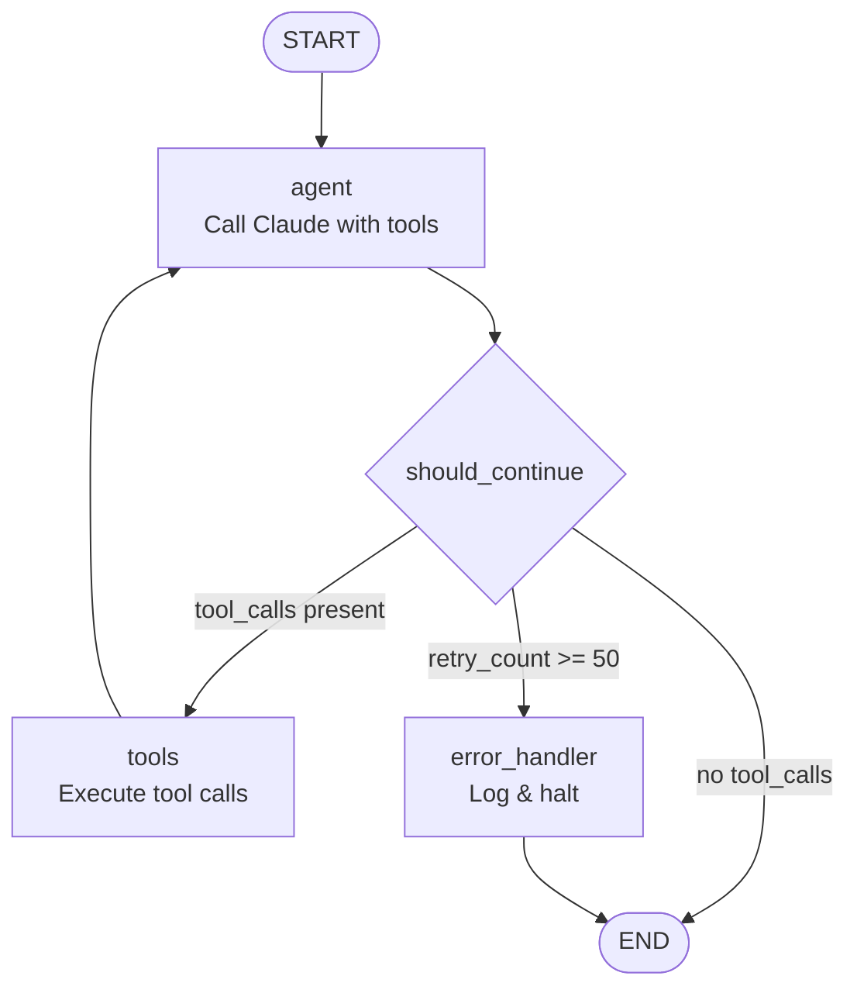
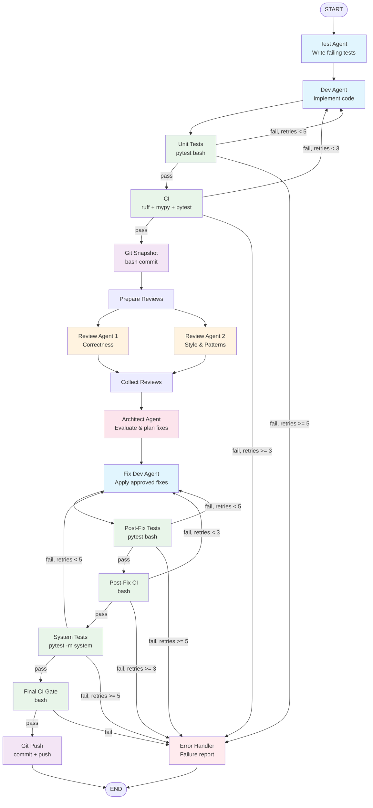

# CODEAGENT.md — Shipyard

**Submission Tier:** Final

## Agent Architecture (Final)

### Overview

Shipyard is an autonomous coding agent built on **LangGraph** (Python) with **Claude** via the Anthropic SDK (`langchain-anthropic`). It runs as a persistent process — either a FastAPI server (`POST /instruct`) or an interactive CLI loop — accepting instructions continuously without restarting. State is checkpointed to SQLite after every graph node, enabling session resumption across restarts.

### Core Loop Design

The agent uses a custom **`StateGraph`** with two primary nodes in a ReAct (Reason + Act) pattern:

```
START → agent_node → should_continue → tool_node → agent_node → ... → END
```

- **`agent_node`**: Calls Claude with the system prompt + accumulated messages. Returns an AI message that may contain tool calls.
- **`tool_node`**: Executes all tool calls from the last AI message. Returns `ToolMessage` results.
- **`should_continue`** (conditional edge): If `retry_count >= 50`, route to `error_handler`. If the AI message contains `tool_calls`, route to `tool_node`. Otherwise, route to `END`.

The loop continues until Claude responds without requesting any tool calls — meaning it has completed the task or is reporting a final answer.


```mermaid
graph TD
    START([START]) --> agent[agent<br/>Call Claude with tools]
    agent --> should_continue{should_continue}
    should_continue -->|tool_calls present| tools[tools<br/>Execute tool calls]
    should_continue -->|no tool_calls| END_NODE([END])
    should_continue -->|retry_count >= 50| error[error_handler<br/>Log & halt]
    tools --> agent
    error --> END_NODE
```

### State Schema

```python
class AgentState(MessagesState):
    task_id: str                                    # Unique task identifier
    retry_count: int                                # Current retry count for circuit breaking
    current_phase: str                              # "test" | "implementation" | "review" | "architect" | "fix" | "ci" | "post_fix_test" | "post_fix_ci"
    agent_role: str                                 # "dev" | "test" | "reviewer" | "architect" | "fix_dev"
    files_modified: Annotated[list[str], operator.add]  # Accumulated list of modified file paths
```

State fields beyond `messages` enable conditional routing (e.g., `retry_count > 3` → error handler), trace metadata, and audit logging without parsing message history.

### Entry and Exit Conditions

**Entry (normal run):**
- User sends instruction via `POST /instruct` or CLI input
- `AgentState` is initialized with the instruction as a `HumanMessage`
- Config includes `thread_id` for session persistence and metadata for tracing

**Exit (normal):**
- Claude responds without tool calls → graph reaches `END`
- Response returned to user

**Exit (error):**
- Global turn cap (50 LLM turns) exceeded → error handler logs report, halts task
- Per-operation retry limits exceeded (3 edit retries, 5 test cycles, 3 CI failures) → error handler escalates to user
- Error handler produces a failure report and surfaces it for human intervention

### Persistence

- **Checkpointer:** `SqliteSaver` from `langgraph-checkpoint-sqlite`
- **Granularity:** State persisted after every node execution
- **Session resumption:** Same `thread_id` in config restores full conversation history and state
- **New session:** Different `thread_id` starts fresh

### Tool Definitions

All tools follow a consistent contract: string parameters in, string result out. Success returns start with `SUCCESS:`, errors start with `ERROR:` with a recovery hint.

| Tool | Description | Parameters |
|---|---|---|
| `read_file` | Read file contents | `file_path: str` |
| `edit_file` | Exact string replacement (surgical edit) | `file_path: str, old_string: str, new_string: str` |
| `write_file` | Create or overwrite a file | `file_path: str, content: str` |
| `list_files` | Glob pattern matching in a directory | `pattern: str, path: str = "."` |
| `search_files` | Regex search across file contents | `pattern: str, path: str = "."` |
| `run_command` | Execute a shell command with timeout | `command: str, timeout: str = "30"` |

### Context Injection

Three-layer system to manage token cost while ensuring agents have the context they need:

- **Layer 1 (Always Present):** Agent role description, project conventions, orchestration guidance — injected as the system prompt at agent start. Small footprint (<3K tokens).
- **Layer 2 (Task-Specific):** Task description, relevant file paths, prior agent output files (e.g., review files, fix plans) — injected with the task assignment as part of the user message.
- **Layer 3 (On-Demand):** Agent uses `read_file`, `list_files`, and `search_files` tools to explore the codebase during execution. Unbounded but governed by the agent's judgment and context window limits.

### Observability

- **LangSmith auto-tracing:** Activated via environment variables (`LANGCHAIN_TRACING_V2=true`). Every node execution, LLM call, tool call, and conditional edge decision is traced automatically with zero custom code.
- **Custom metadata:** Every agent invocation includes `agent_role`, `task_id`, `model_tier`, `phase`, and `parent_session` in the config metadata for filtering and linking traces.
- **Markdown audit log:** Local `logs/session-{id}.md` files provide a human-readable record of each session — agent actions, tool calls, results, and costs in a tree-style format.

---

## File Editing Strategy (Final)

### Mechanism: Anchor-Based Exact String Replacement

The `edit_file` tool performs surgical edits using exact string matching:

```
edit_file(file_path, old_string, new_string)
```

1. Read the file contents
2. Count occurrences of `old_string` in the file
3. If count == 0 → return `ERROR: old_string not found. Re-read the file to get current contents.`
4. If count > 1 → return `ERROR: old_string found {count} times. Provide more surrounding context to make the match unique.`
5. If count == 1 → replace `old_string` with `new_string`, write the file, return `SUCCESS`

### Why This Strategy

- **Fail-loud:** No fuzzy matching. Edits either succeed exactly or fail with a diagnostic error. Silent corruption is impossible.
- **Robust to line drift:** Unlike line-range replacement, adding/removing lines above the target doesn't break subsequent edits.
- **Language-agnostic:** No parser needed per language (unlike AST-based editing).
- **LLM-native:** Claude produces exact string matches more reliably than unified diffs, which require precise hunk headers.

### What Happens When It Gets the Location Wrong

Claude's trained self-correction behavior handles this:

1. **No match found (stale context):** Edit tool returns error → Claude re-reads the file to refresh its view of current contents → retries with accurate `old_string`
2. **Non-unique match:** Edit tool returns error with match count → Claude provides more surrounding context to disambiguate → retries with a longer, unique `old_string`
3. **No match found (hallucinated content):** Edit tool returns error → Claude re-reads the file → discovers actual content differs from what it assumed → retries with real content

### Retry Limits

- 3 consecutive edit failures on the same target → force a complete file re-read and fresh approach
- These per-edit retries count toward the global 50-turn cap

### Recovery Layers

1. **Layer 1 — Claude self-correction:** Edit tool fails loudly → Claude re-reads and retries (zero implementation cost, always active)
2. **Layer 2 — Post-edit validation:** After successful edits, lint (ruff) and type check (mypy) run via bash. New errors are fed back to the agent for correction.
3. **Layer 3 — Git snapshot rollback:** Before significant edit sequences, a git commit snapshot is created. If downstream review flags unfixable problems, the Architect can direct a rollback.

---

## Multi-Agent Design

### Orchestration Model

**Hybrid: Subgraphs (sequential pipeline) + `Send` API (parallel fan-out)**

The pipeline is inherently sequential — tests must pass before CI runs, CI must pass before review begins. The single exception is the review phase, where two reviewers analyze code independently. This maps naturally to a hybrid pattern:

- **Sequential stages:** Each pipeline phase is a node in a parent `StateGraph`, connected by conditional edges that route on pass/fail
- **Parallel fan-out:** The `Send` API spawns two Review Agent instances concurrently, collecting results at a fan-in node

The parent `StateGraph` (`src/multi_agent/orchestrator.py`) contains 16 nodes organized into 7 phases:

1. **TDD Phase:** `test_agent` → `dev_agent`
2. **Validation Phase:** `unit_test` → `ci` → `git_snapshot`
3. **Review Phase:** `prepare_reviews` → `review_node` (×2 via Send) → `collect_reviews`
4. **Architect Phase:** `architect_node` → `fix_dev_node`
5. **Post-Fix Validation:** `post_fix_test` → `post_fix_ci`
6. **System Validation:** `system_test` → `final_ci`
7. **Delivery:** `git_push`

Plus `error_handler` for circuit-breaking when retry limits are exceeded.

**Sub-agent spawning:** `create_agent_subgraph()` (`src/multi_agent/spawn.py`) builds a role-specific compiled graph with its own tools, system prompt, and model tier. Each sub-agent gets a fresh context window — no parent message history is inherited. This prevents context pollution between phases and keeps each agent focused on its specific task.

### Agent Communication

**File-based coordination.** Agents do not share message history or memory. Each agent writes output to designated files; downstream agents read those files as context input.

Inter-agent files use YAML frontmatter for machine-parseable metadata:

```yaml
---
agent_role: reviewer
task_id: story-42
timestamp: 2026-03-24T12:00:00+00:00
input_files: [src/foo.py, tests/test_foo.py]
reviewer_id: 1
---

# Code Review — Agent 1

## Summary
Found 2 issues in error handling paths.

## Findings

### 1. Missing timeout on subprocess call
- **File:** src/tools/bash.py
- **Issue:** run_command has no timeout default
- **Severity:** major
- **Action:** Add timeout=300 parameter
```

**Communication artifacts by role:**

| Agent | Writes To | Read By |
|---|---|---|
| Test Agent | `tests/` (test files) | Dev Agent (reads to understand what to implement) |
| Dev Agent | `src/` (source files, tracked in state) | Unit test node, CI node |
| Review Agent 1 | `reviews/review-agent-1.md` | Architect Agent |
| Review Agent 2 | `reviews/review-agent-2.md` | Architect Agent |
| Architect Agent | `fix-plan.md` | Fix Dev Agent |
| Fix Dev Agent | `src/` (fixed source files) | Post-fix test/CI nodes |

**Why file-based:** Debuggable (every inter-agent artifact is a readable markdown file), persistent (survives crashes — checkpointed pipeline can resume), and avoids shared-memory complexity. An evaluator can inspect `reviews/` and `fix-plan.md` to understand exactly what each agent decided.

### Parallel Review & Architect Merge

**Prepare reviews:** The `prepare_reviews_node` clears the `reviews/` directory (removing stale files and subdirectories while preserving `.gitkeep`) before spawning reviewers. This ensures a clean slate for each pipeline run.

**Fan-out:** The `route_to_reviewers()` function returns two `Send` objects targeting the same `review_node` graph node, each with a different `reviewer_id` and focus area. LangGraph executes them in parallel.

**Reviewer differentiation:**
- **Reviewer 1** focuses on correctness: logic errors, missing edge cases, test coverage gaps
- **Reviewer 2** focuses on style: architectural patterns, naming conventions, maintainability

**Fan-in:** Both reviews must complete before the `collect_reviews` node runs. It validates that both review files exist and contain YAML frontmatter. If validation fails, the pipeline records an error.

**Architect gatekeeper:** The Architect Agent (Opus model tier for complex multi-file reasoning) reads both review files and every source file mentioned in findings. For each finding, it decides **fix** or **dismiss** with written justification. The output is a single `fix-plan.md` — the sole source of truth for the Fix Dev Agent. This prevents blind auto-merging of review suggestions and ensures a qualified agent evaluates conflicting recommendations.

**Fix Dev Agent:** A fresh agent (no shared history with the original Dev Agent) reads `fix-plan.md` and applies only the approved fixes. Scope discipline is enforced — it cannot attempt fixes not in the plan.

### Pipeline Diagram


```mermaid
graph TD
    START([START]) --> test_agent[Test Agent<br/>Write failing tests]
    test_agent --> dev_agent[Dev Agent<br/>Implement code]
    dev_agent --> unit_test[Unit Tests<br/>pytest bash]
    unit_test -->|pass| ci[CI<br/>ruff + mypy + pytest]
    unit_test -->|fail, retries < 5| dev_agent
    unit_test -->|fail, retries >= 5| error_handler
    ci -->|pass| git_snapshot[Git Snapshot<br/>bash commit]
    ci -->|fail, retries < 3| dev_agent
    ci -->|fail, retries >= 3| error_handler
    git_snapshot --> prepare_reviews[Prepare Reviews]
    prepare_reviews --> reviewer_1[Review Agent 1<br/>Correctness]
    prepare_reviews --> reviewer_2[Review Agent 2<br/>Style & Patterns]
    reviewer_1 --> collect[Collect Reviews]
    reviewer_2 --> collect
    collect --> architect[Architect Agent<br/>Evaluate & plan fixes]
    architect --> fix_dev[Fix Dev Agent<br/>Apply approved fixes]
    fix_dev --> post_fix_test[Post-Fix Tests<br/>pytest bash]
    post_fix_test -->|pass| post_fix_ci[Post-Fix CI<br/>bash]
    post_fix_test -->|fail, retries < 5| fix_dev
    post_fix_test -->|fail, retries >= 5| error_handler
    post_fix_ci -->|pass| system_test[System Tests<br/>pytest -m system]
    post_fix_ci -->|fail, retries < 3| fix_dev
    post_fix_ci -->|fail, retries >= 3| error_handler
    system_test -->|pass| final_ci[Final CI Gate<br/>bash]
    system_test -->|fail, retries < 5| fix_dev
    system_test -->|fail, retries >= 5| error_handler
    final_ci -->|pass| git_push[Git Push<br/>commit + push]
    final_ci -->|fail| error_handler
    git_push --> END_NODE([END])
    error_handler[Error Handler<br/>Failure report] --> END_NODE

    style test_agent fill:#e1f5fe
    style dev_agent fill:#e1f5fe
    style fix_dev fill:#e1f5fe
    style reviewer_1 fill:#fff3e0
    style reviewer_2 fill:#fff3e0
    style architect fill:#fce4ec
    style unit_test fill:#e8f5e9
    style ci fill:#e8f5e9
    style post_fix_test fill:#e8f5e9
    style post_fix_ci fill:#e8f5e9
    style system_test fill:#e8f5e9
    style final_ci fill:#e8f5e9
    style git_snapshot fill:#f3e5f5
    style git_push fill:#f3e5f5
    style error_handler fill:#ffebee
```

**Legend:** Blue = LLM agent nodes, Orange = Review agents, Pink = Architect, Green = Bash validation nodes, Purple = Git operations, Red = Error handler.

### Role Summary

| Role | Model Tier | Tools | Output | Source File |
|---|---|---|---|---|
| Test Agent | Sonnet | read_file, write_file (tests/), list_files, search_files, run_command | Test files in `tests/` | `src/multi_agent/roles.py` |
| Dev Agent | Sonnet | read_file, edit_file, write_file, list_files, search_files, run_command | Source files in `src/` | `src/multi_agent/roles.py` |
| Review Agent | Sonnet | read_file, list_files, search_files, write_file (reviews/) | `reviews/review-agent-{n}.md` | `src/multi_agent/roles.py` |
| Architect | Opus | read_file, list_files, search_files, write_file (reviews/, fix-plan.md) | `fix-plan.md` | `src/multi_agent/roles.py` |
| Fix Dev | Sonnet | read_file, edit_file, write_file, list_files, search_files, run_command | Fixed source files | `src/multi_agent/roles.py` |

**Key implementation files:**
- `src/multi_agent/orchestrator.py` — Parent StateGraph with all 16 nodes and conditional routing
- `src/multi_agent/spawn.py` — `create_agent_subgraph()` and `run_sub_agent()` factory functions
- `src/multi_agent/roles.py` — Role definitions, model tiers, tool permissions, trace config
- `src/agent/prompts.py` — Role-specific system prompt templates

---

## Trace Links (Final)

- **Trace 1 (1st part):** [https://smith.langchain.com/public/7f27a16b-6e3e-4d0e-b332-0f30b2996463/r](https://smith.langchain.com/public/7f27a16b-6e3e-4d0e-b332-0f30b2996463/r)

- **Trace 2 (2nd part):** [https://smith.langchain.com/public/c1d7e1ac-9852-4c26-a1f9-29c1e19bb767/r](https://smith.langchain.com/public/c1d7e1ac-9852-4c26-a1f9-29c1e19bb767/r)

---

## Public Monitoring Dashboard (Command Bridge)

**Live at:** [shipyard-production-29ae.up.railway.app](https://shipyard-production-29ae.up.railway.app/) — publicly accessible, no login required.

The Command Bridge provides real-time observability into the software factory. Anyone can watch live builds as they happen or replay any previous run from a session dropdown.

### Dashboard Components

- **Health Badge** — polls `GET /health` every 30 seconds. Green dot = online, red dot = offline.
- **LIVE Indicator** — pulsing amber badge appears automatically when a pipeline is actively running.
- **Pipeline Output Terminal** — full-screen log viewer streaming real-time output. Shows LIVE tag during active builds, REPLAY tag when viewing past sessions. Session dropdown selects previous runs.
- **Rebuild Pipeline Flow Graph** — visual node graph: Load Backlog → Init Project → [per story: TDD Pipeline → Test → Review → Git Tag] → Complete. Nodes light up idle/active/completed/failed as the pipeline progresses. Story label shows which story is being processed.
- **Stats Bar** — Completed, Failed, Interventions, Total counters with a progress bar.

### Data Flow

During a rebuild, the local Docker pipeline streams log events via `web_relay.py` to the Railway-hosted `log_relay.py`, which stores them in Postgres. The dashboard connects via SSE (`/api/stream/{session_id}`) for real-time delivery. For past runs, stored events are fetched and replayed into the terminal. The dashboard auto-detects active sessions.

### Implementation

| Component | Source |
|---|---|
| Dashboard UI | `src/static/index.html` — single-file HTML/CSS/JS, industrial/naval theme |
| Log relay (server) | `src/log_relay.py` — Postgres storage, SSE streaming, session management |
| Web relay (client) | `src/web_relay.py` — intercepts print/logging output, batches events to Railway |
| Monitoring API | `/api/sessions`, `/api/logs/{session_id}`, `/api/stream/{session_id}` (public read-only) |

---

## Architecture Decisions (Final Submission)

These are the key architecture decisions made when building Shipyard (the factory/agent system), what alternatives were considered, and why each call was made. Full details in [architecture.md](_bmad-output/planning-artifacts/architecture.md).

### 1. Custom `StateGraph` from Day One

**Alternatives considered:** (a) Start with LangGraph's `create_react_agent` prebuilt for MVP, then refactor to custom `StateGraph` for multi-agent. (b) Build custom `StateGraph` immediately.

**Decision:** Custom `StateGraph` from the start. A 2-node StateGraph (agent + tools) is nearly identical code to `create_react_agent`, but avoids a mid-week refactoring when multi-agent coordination is added. The same graph grows organically from single-agent MVP to the full 16-node pipeline by adding nodes and edges — no architectural break between MVP and final submission.

### 2. Hybrid Multi-Agent: Subgraphs + `Send` API

**Alternatives considered:** (a) Pure sequential subgraphs. (b) Pure `Send` API fan-out for all agents. (c) Hybrid — subgraphs for sequential stages, `Send` for parallel review.

**Decision:** Hybrid. The pipeline is inherently sequential (Test → Dev → CI → Review → Architect → Fix Dev → CI → Push) except for one step: the parallel review phase where two independent reviewers analyze the same code. Subgraphs model the sequential flow naturally; the `Send` API models the fan-out/fan-in review step. Forcing everything into one pattern would either serialize naturally parallel work or add unnecessary complexity to naturally sequential work.

### 3. Extended `AgentState` Schema

**Alternatives considered:** (a) Use bare `MessagesState` and parse message history for routing decisions. (b) Extend `MessagesState` with explicit fields for `task_id`, `retry_count`, `current_phase`, `agent_role`, and `files_modified`.

**Decision:** Extended state. Explicit fields enable conditional routing in the graph (e.g., `retry_count >= 50` → error handler) without parsing message history. They also make LangSmith traces self-documenting — every trace carries metadata about which agent, which phase, and which task, enabling filtering and debugging without reading message contents.

### 4. Dual Retry Limits

**Alternatives considered:** (a) Single global turn cap. (b) Per-operation limits only. (c) Both.

**Decision:** Both. A global 50-turn cap prevents runaway cost, but it alone won't catch a 40-turn edit loop that stays under the cap — the agent burns budget without making progress. Per-operation limits (3 edit retries, 5 test cycles, 3 CI failures) catch specific doom loops early and escalate to the error handler before the global cap is consumed. The two layers are complementary, not redundant.

### 5. Shared Working Directory with Role-Based Write Restrictions

**Alternatives considered:** (a) Isolated directories per agent (copy files between agents). (b) Shared directory with no restrictions. (c) Shared directory with role-based tool subsetting.

**Decision:** Shared directory with restrictions. Isolated directories add copy/sync complexity for zero benefit in a sequential pipeline. Unrestricted access risks the "fix it while reviewing" anti-pattern — a reviewer editing source code instead of documenting findings. Role-based tool subsetting (review agents get read-only source access, write access only to `reviews/`) enforces discipline without directory management overhead.

### 6. Markdown Audit Logs

**Alternatives considered:** (a) Structured JSON logs. (b) LangSmith-only (no local logs). (c) Human-readable markdown logs.

**Decision:** Markdown. LangSmith already provides machine-parseable structured data — duplicating that locally in JSON adds no value. Markdown logs are human-readable, directly feed the deliverables (AI Development Log, CODEAGENT.md), and can be reviewed without tooling. The tree-style format (`├─ [Agent] → [Action] → [Result]`) makes session flow visible at a glance.

---

## Ship Rebuild Log (Final Submission)

This log documents what happened when Shipyard (the factory) was used to rebuild Ship — a government-grade project management platform — from scratch. The rebuild simultaneously migrated the backend from Node.js to Go, overhauled the database schema, and redesigned the UX.

### Run Summary

| Metric | Value |
|---|---|
| Total stories completed | 40 of 40 |
| Total epics | 9 |
| Pipeline wall-clock time | 28 hours 35 minutes |
| Total elapsed time (incl. downtime) | ~31.5 hours |
| Total API cost | $495.36 |
| Total agent invocations | 225 |
| Failed agent invocations | 0 |
| Total log events recorded | 34,827 |

### Run 1: Epics 1–2 (12 stories, 6h 48m)

The pipeline ran 12 stories across the first two epics without any code failures, agent errors, or stuck states. The run terminated when the prepaid credit card funding the Anthropic API was exhausted mid-pipeline.

### Downtime (~3 hours)

Rather than simply restarting from the last completed story, approximately 2 hours were spent attempting to improve the factory's pause-and-resume feature — modifying code, testing changes, and iterating on the implementation. This was a conscious choice to improve the factory tooling rather than work around the problem, but it consumed time without producing a reliable pause/resume mechanism.

**Resolution:** The pragmatic fix was to manually edit the pipeline's status file to indicate where to resume, then restart. This took minutes and worked immediately.

### Run 2: Epics 3–9 (28 stories, 21h 46m)

The pipeline resumed at story 2-7 and ran the remaining 28 stories to completion with **zero human involvement**. No agent failures, no stuck states, no code errors requiring manual correction. The pipeline managed its own quality gates autonomously for nearly 22 hours straight.

### Intervention Log

| # | Type | Cause | Resolution | What It Reveals |
|---|---|---|---|---|
| 1 | Pause/restart | Prepaid credit card exhausted | Manually edited status file to set resume point, restarted pipeline | Pause/resume feature was not production-ready. The pipeline itself never failed — this was an external billing issue. |

**Total interventions: 1.** The intervention was not caused by the agent producing incorrect code, failing CI, or getting stuck on a task. It was caused by running out of funds on a prepaid card. If the financial setup had been correct from the start, the run would have completed end-to-end with zero interventions.

### Post-Run Observations

**What the factory handled well:**
- CRUD operations across all 10 entity types
- Database schema creation with constraints, triggers, and 18 migrations
- Multi-layer Go architecture (handler → service → repository)
- Frontend feature modules with hooks, API layers, and components
- Self-correction via the implement → test → review → fix loop

**What needs improvement:**
- **Visual fidelity:** The factory produces functional UI but does not achieve pixel-level consistency with design mockups. A dedicated styling pass appears needed as a post-pipeline step.
- **Pause/resume robustness:** The pipeline's ability to stop and restart mid-run needs hardening — it was faster to manually edit a status file than to debug the feature under pressure.
- **CI coverage:** The CI scripts used during the run did not catch the full range of issues (linting, full type checking). Stories passed a bar that was set too low.
- **No migration verification:** The pipeline never stood up a PostgreSQL instance to verify that migrations execute without errors. A migration verification step needs to be added.

**What did not go wrong:** The factory never produced code that failed to compile, never required a story to be abandoned or manually rewritten, never hallucinated imports or APIs, and maintained architectural consistency across all 40 stories despite having no memory between story executions.

---

## Comparative Analysis (Final Submission)

This section compares the agent-built ShipRebuild against the original Ship application. The full analysis with detailed evidence is in [comparative-analysis.md](gauntlet_docs/comparative-analysis.md).

### 1. Executive Summary

Shipyard rebuilt Ship — a government-grade project management platform — from scratch, simultaneously migrating the backend from Node.js to Go 1.25.5, overhauling the database from a single-table polymorphic model to a hybrid schema with typed property tables, and redesigning the UX from a unified document page to feature-first modules. The factory completed all 40 stories across 9 epics in 28 hours 35 minutes at an API cost of $495.36, with zero failed agent invocations and one external intervention (prepaid card exhaustion).

### 2. Architectural Comparison

The agent-built version differs from the original in five fundamental ways:

- **Language migration (Node.js → Go 1.25.5):** Aligns with White House ONCD and CISA/NSA memory-safe language guidance. Single-binary deployment eliminates the deep Node.js dependency tree. A human developer would not have attempted this migration on a one-week timeline.
- **Schema redesign ("everything is a document" → hybrid):** The original stored all 10 entity types in one table with unvalidated JSONB properties. The rebuild keeps a shared `documents` table for genuinely shared concerns but moves type-specific data to 10 dedicated property tables with real columns, constraints, and triggers. Queries drop from 4–5 JOINs to 1.
- **Collaboration model (Yjs CRDT → deferred block-locking):** Removed the Node.js WebSocket sidecar requirement. Government PM workflows are predominantly asynchronous — character-level real-time editing is a rare edge case, not a core workflow.
- **UX philosophy (unified document page → feature-first modules):** Replaced a single polymorphic page rendering all 10 types with 11 self-contained feature modules, each owning its own components, hooks, and API layer. Added Command Palette (Cmd+K), "My Work" home view, and contextual sidebar.
- **Deployment (AWS multi-service → single binary on Railway):** From three independent services managed with Terraform to one container serving both API and static assets.

### 3. Performance Benchmarks

| Metric | Original Ship | ShipRebuild |
|---|---|---|
| Backend language | TypeScript (Node.js/Express) | Go 1.25.5 (stdlib net/http) |
| Backend LOC | ~7,000 | ~49,500 |
| Frontend LOC | ~8,000 (React 18) | ~14,700 (React 19) |
| Total source files | 353 | 292 |
| Database migrations | 38 | 18 |
| Type safety violations | 875 (`: any`, `as any`) | 0 (Go is statically typed) |

The Go backend is larger in raw LOC due to Go's verbosity (explicit error handling, struct definitions, co-located tests). The database tells a cleaner story: 18 migrations vs. 38, because the architecture was designed up front rather than evolving organically.

**Factory velocity:** 40 stories in 28h 35m pipeline time. Median story duration: 37m 33s. Average cost per story: $12.08. Later epics cost more as codebase grew (Epic 8 averaged $16.34/story vs. Epic 1 at $6.93/story).

### 4. Shortcomings

- **One external intervention:** Prepaid credit card exhaustion required a manual restart. The pause/resume feature was not production-ready.
- **Visual fidelity gap:** The UI is functional but does not match the detailed UX design specs. Layout and interactions are present; styling and polish are not.
- **CI was too lenient:** The CI scripts used during the rebuild did not include comprehensive linting or full type checking. The "all stories passing CI" metric overstates actual code quality.
- **No migration verification:** Database migrations were never applied to an actual PostgreSQL instance during the build. Syntax or ordering issues would not have been caught.
- **Runtime benchmarks not yet captured:** API response times, frontend bundle size, page load times, and accessibility audits on ShipRebuild have not been measured.

### 5. Advances

- **Every line was faster:** No individual story where a human would have been faster. Conservative estimate for equivalent manual work: 6–12 months with a team.
- **Zero-memory consistency:** 40 stories maintained architectural consistency (handler/service/repository layering, consistent API formats) without any agent remembering a previous story. Well-structured planning artifacts proved more reliable than agent memory.
- **Self-correcting pipeline:** 225 invocations, 0 failures. The fix-up agent was called 53 times — this is the pipeline working as designed, not failing.
- **Predictable cadence:** Median story: 37m 33s, average: 41m 49s. Consistent enough to plan around: N stories ≈ N × 42 minutes, N × $12.
- **Infrastructure reliability:** Zero freezes across 31.5 hours on Railway, compared to repeated freezes on local Docker Desktop. The factory needs production-grade infrastructure.

### 6. Trade-off Analysis

- **Go over Node.js:** Right call. Government policy alignment, single-binary deployment, simpler security surface. Trade-off: Go is more verbose (~49K LOC vs. ~7K), but this may be a net positive for auditability.
- **Hybrid schema over single-table:** Right call. The original codebase was already 70% type-specific — the schema was pretending to be unified while the code had diverged. The hybrid model makes the database honest.
- **Dropping Yjs/CRDT:** Right call for v1. Simplifies deployment and matches actual usage patterns. Most visible user-facing trade-off — if users expect Google Docs-style editing, v1 will feel like a step backward.
- **Feature-first frontend:** Right call. Each entity type gets its own visual identity instead of being forced through an identical polymorphic interface.
- **Railway over local Docker:** Unequivocally right. Zero freezes vs. repeated freezes. Production infrastructure is not optional for the factory.

### 7. If You Built It Again

- **The agent architecture would not change.** Skills as the unit of agent capability, document-grounded context injection, and structured workflows produced a zero-failure rate across 225 invocations.
- **The planning phase would not change.** The quality of planning artifacts directly determines factory output quality. Well-structured stories with BDD acceptance criteria produce working code; vague stories produce vague code.
- **Add continuous deployment and verification.** The pipeline stops at CI. Adding a deployment step and smoke tests against the live service would close the loop to production validation.
- **Batch stories for throughput.** Processing one story at a time through the full loop is reliable but slow. Agents can handle 3–5 stories per invocation for implementation, or 10 for review passes.
- **Don't reinvent the wheel.** The most important lesson: agent skills — structured prompts with document sources, personas, and workflows — are available in open-source libraries. Use them as foundations and customize, rather than building from scratch.

---

## Cost Analysis (Final Submission)

### Development Costs (Building Shipyard)

Shipyard was developed using Claude Code (Opus 4.6), not by running Shipyard's own agent loop. The agent's LangSmith traces contain only tool invocations from unit/integration tests — zero actual Claude model calls through the Shipyard API.

| Item | Amount |
|---|---|
| Claude API — input tokens (via Claude Code) | ~7.5M tokens (~$112.50) |
| Claude API — output tokens (via Claude Code) | ~2.0M tokens (~$150.00) |
| Shipyard agent API calls during development | 0 ($0.00) |
| Total estimated development spend | **~$262.50** |
| Estimated interactions | ~500 over 5 days |
| Codebase produced | 35 source files, 29 test files, 12,815 lines |
| Cost per line of code | ~$0.020 |

### Rebuild Costs (Running Shipyard Against Ship)

| Item | Amount |
|---|---|
| Total API cost for 40-story rebuild | **$495.36** |
| Average cost per story | $12.08 |
| Implementation agents (dev-story + dev) | $294.01 (59.4%) |
| Test generation (testarch-atdd) | $92.07 (18.6%) |
| Story spec creation | $48.18 (9.7%) |
| Code review & architecture review | $37.53 (7.6%) |
| Fix agents (category A fixes) | $23.55 (4.8%) |
| Total agent invocations | 225 |
| Total agent turns | 10,793 |

### Combined Total Development Spend

| Category | Amount |
|---|---|
| Building Shipyard (Claude Code) | ~$262.50 |
| Running the Ship rebuild (API) | $495.36 |
| **Total project spend** | **~$757.86** |

### Production Cost Projections (Instruct Mode)

Assumptions: 10 instructions/user/day, 22 working days/month, $1.88/instruction (weighted Sonnet + Opus routing), 14 LLM invocations per instruction (weighted average across Dev, Test, Reviewer, Fix Dev, Architect roles).

| Scale | Monthly Cost | Cost/User/Month |
|---|---|---|
| 100 Users | $41,426 /month | $414.26 |
| 1,000 Users | $414,260 /month | $414.26 |
| 10,000 Users | $4,142,600 /month | $414.26 |

**With optimizations (prompt caching + Haiku routing for read ops):** Costs reduce by ~65%, bringing the 100-user tier to ~$14,500/month (~$145/user/month).

**Break-even:** At the optimized rate, the agent costs 2–3% of equivalent developer time. Even unoptimized, it costs 4–6% — economically viable if task completion quality meets production standards.

Full cost analysis with model routing details, token breakdowns, and optimization recommendations: [cost-analysis.md](gauntlet_docs/cost-analysis.md).
