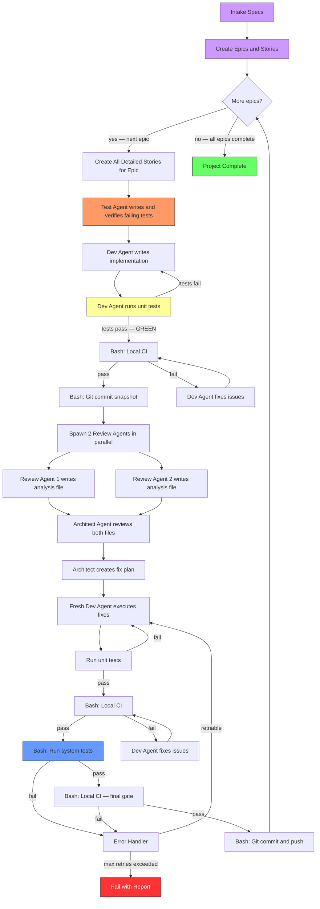
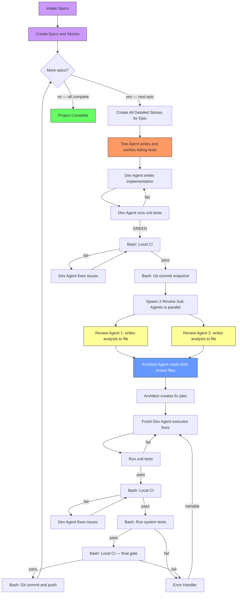

# Pre-Search Checklist

> Complete this before writing any code. The goal is to make informed decisions about your agent's architecture before you are under time pressure.

---

## Phase 1: Open Source Research

### Question 1: Agent Studies

**Agents studied:** OpenCode, LangChain Deep Agents, Claude Code

**Primary model chosen: Claude Code**

**Decision rationale:** Claude Code's strict exact-string-replacement editing with mandatory read-before-edit was the deciding factor. OpenCode and Deep Agents both incorporate fuzzy matching fallbacks for file edits, which introduces unpredictability — if the fuzzy matcher picks a near-miss instead of the intended target, the resulting corruption is silent and hard to diagnose. Claude Code's approach fails loudly when there's no exact match, which is far preferable: a failed edit you can see and retry is safer than a "successful" edit that changed the wrong thing.

#### Key Differentiators Between the Three Agents

**OpenCode (TypeScript/Bun)**
- **LSP diagnostic feedback loop** — after every file edit, queries the language server and feeds type/syntax errors back to the LLM for immediate self-correction. Neither Claude Code nor Deep Agents does this natively.
- **Git-based snapshot rollback** — uses `git write-tree` / `git read-tree` as lightweight transaction boundaries, enabling `/undo` and `/redo` without a separate version history system.
- **Plugin hook system** — 8 hook categories (`tool.execute.before`, `session.compacting`, etc.) allow deep customization without forking. The `session.compacting` hook for injecting domain-specific context into summaries is unique.
- **Bun runtime** — fast but limits deployment environments compared to Node.js or Python.
- **Weakness:** No circuit breaker for repeated tool failures. Relies entirely on the LLM self-correcting from error text. Subagents are stateless and one-directional — cannot ask the parent for clarification.

**LangChain Deep Agents (Python)**
- **Middleware architecture** — composable pipeline with `before_agent`, `wrap_model_call`, `wrap_tool_call` lifecycle hooks. Registration order matters; `wrap_tool_call` runs in reverse order (outermost = approval gate). This is the most extensible pattern of the three.
- **LoopDetectionMiddleware** — monitors per-file edit counts and injects corrective guidance to break doom loops. Neither OpenCode nor Claude Code has a built-in equivalent.
- **PreCompletionChecklistMiddleware** — forces the agent to verify its work against the task spec before declaring done. Catches premature completion.
- **Virtual filesystem as coordination primitive** — agents share state through a virtual filesystem rather than message passing. Large tool results (>20K tokens) are saved to disk and replaced with file references.
- **Model agnostic** — works with any LLM that supports tool calling, unlike Claude Code (Anthropic-only) or OpenCode (multi-provider but Anthropic-optimized).
- **Weakness:** No structured retry logic. Single-level subagent depth (no nesting). Significant sampling variance across runs on benchmarks.

**Claude Code (TypeScript, Anthropic-only)**
- **Strict exact-string editing with mandatory read-before-edit** — the most conservative and predictable editing model. MultiEdit tool enables atomic batch operations (all succeed or none apply).
- **Tiered sub-agents with model routing** — Haiku for fast exploration, Opus for complex reasoning. Cost-effective and preserves main-conversation context. Background sub-agents (Ctrl+B) allow parallel human+agent work.
- **CLAUDE.md as persistent memory** — re-injected after every compaction, survives context resets. Acts as always-available project context that the agent can both read and write.
- **Prompt caching** — static prefixes (system prompt, tool definitions, CLAUDE.md) are cached, dramatically reducing cost for multi-turn sessions.
- **Small, focused tool set (~12 tools)** — keeps tool definitions compact in context. On-demand tool loading via `ToolSearch` for MCP integrations.
- **OS-level sandboxing** — Linux bubblewrap, macOS seatbelt for defense-in-depth beyond LLM decision-making.
- **Weakness:** Permission UX is binary (constant prompts vs. total trust). No built-in OnToolError hook. Bash can bypass Read/Edit deny rules (e.g., `cat .env` bypasses a `Read(.env)` deny). No cross-session learning by default.

### Question 2: File Editing Strategy Selection

**Strategy chosen: Anchor-Based Replacement (Exact String Match)**

**Why this strategy:**
- All three agents studied (OpenCode, Deep Agents, Claude Code) use exact string replacement as their core editing mechanism. This is the industry-proven approach for LLM-driven code editing.
- It is the safest route: edits fail loudly when the match string isn't found or isn't unique, rather than silently corrupting files through fuzzy approximation.
- It is robust to line number drift — unlike line-range replacement, adding or removing lines above the target doesn't break subsequent edits.
- It is language-agnostic — unlike AST-based editing, no parser is needed per language.
- It is simpler for LLMs to produce correctly than unified diffs, which require precise hunk headers and context lines.

**Why not the other strategies:**
- **Unified Diff:** LLMs frequently produce malformed diffs. The failure mode (patch rejection) is recoverable, but the frequency of malformation makes this unreliable as a primary strategy.
- **Line-Range Replacement:** Line numbers drift after the first edit in a sequence. Multi-edit operations are almost guaranteed to corrupt without offset recalculation.
- **AST-Based Editing:** Maximally precise but requires a parser per language, massive implementation effort for a one-week sprint, and serialization can alter formatting.

**Failure modes and handling:**
1. **Non-unique match** → Return error with match count. Ask the LLM to provide more surrounding context to disambiguate, then retry.
2. **No match found (stale context)** → Force a re-read of the file to get current contents, then retry the edit with accurate content.
3. **No match found (hallucinated content)** → Force a re-read. The read-before-edit requirement minimizes this, but it can still occur if the LLM fabricates what it thinks the file contains.
4. **Whitespace/encoding mismatch** → Fail loudly. Do NOT attempt fuzzy matching. Re-read the file and retry with byte-accurate content.

---

## Phase 2: Architecture Design

### Question 3: System Diagram

**Architecture chosen: LangGraph-style Graph with Conditional Edges**

**Decision rationale:** The PRD states that LangGraph is recommended, and that any alternative framework must produce equivalent run traces. Building a custom tracing system that matches LangGraph's capabilities is not feasible within a one-week sprint. LangGraph provides built-in LangSmith tracing (traces activate automatically once environment variables are set), conditional edge routing, parallel tool execution, and state persistence — all of which would need to be recreated from scratch with any other approach. This makes LangGraph the only practical choice.

**System Flow (Mermaid):**



**Key design principles in this flow:**
- **Intake Specs node** ingests the project specifications — PRD, architecture docs, UX specs, or any input that defines what needs to be built.
- **Create Epics and Stories node** breaks the specs into epics and stories, producing a prioritized backlog. Each epic becomes one iteration of the development loop.
- **Create All Detailed Stories for Epic** — at the start of each epic loop, all stories for that epic are broken down into detailed, implementation-ready specifications before any coding begins.
- **One epic per loop iteration.** After git commit and push completes for an epic, the flow loops back to check if more epics remain. The next epic's stories are detailed and the full dev cycle (TDD → review → fix → test → push) runs again until all epics are complete.
- **TDD: Test Agent writes and verifies failing tests.** The Test Agent is responsible for the entire RED phase — writing tests, running them, confirming they fail, and revising if needed. All of this happens within the Test Agent's scope. Once the Test Agent has verified failing tests, control passes directly to the Dev Agent.
- **Unit tests run after development**, driven by the Dev Agent. These validate the implementation against the Test Agent's specs.
- **Local CI replaces GitHub Actions.** Instead of burning GitHub Actions quota on every push, a local CI bash script runs the same checks that a CI pipeline would: linting, type checking, formatting, build verification, and any other quality gates appropriate for the language. These scripts are cheap to run locally and can be executed as often as needed without cost concerns.
- **Local CI runs at multiple checkpoints** — after initial development, after review fixes, and as a final gate after system tests but before git push. Bash scripts are cheap; run them liberally.
- **Git push is the very last step**, only after all tests pass and the final local CI gate is clean. Nothing is pushed to the remote until the full pipeline has validated the work.
- **System tests run at the end**, after the review pipeline and fixes are complete. These validate end-to-end behavior of the full feature.
- **No GitHub Actions.** All CI checks run locally via bash scripts. This avoids burning through GitHub Actions quota, which is a limited resource. The local CI script mirrors what GitHub Actions would do, so code that passes locally will pass remotely.
- **Error branch:** At any test or CI failure, the flow routes back to the appropriate agent for correction. After max retries, the flow terminates with a failure report.

**Error branch detail:** When the Edit File Node produces a non-unique match or no-match error, Claude's built-in self-correction re-reads the file and retries. When lint fails, the Dev Agent fixes the issues. When tests fail after fixes, the Dev Agent iterates. When system tests fail at the end, the Error Handler decides whether to retry or halt. After a configurable max retry count, the flow terminates with a failure report rather than looping indefinitely.

### Question 4: File Editing Strategy — Step by Step

**Approach: Delegate to Claude's native tool-use behavior via the Anthropic SDK.**

Our agent invokes Claude through the Anthropic SDK and provides it with tool definitions matching Claude Code's built-in tools: `Read` (file reading) and `Edit` (exact string replacement with `old_string` / `new_string`). Claude already knows this workflow natively — the model was trained on these tool patterns and handles the full edit lifecycle without custom orchestration logic:

1. Claude reads the file before editing (enforced by tool design — Edit fails if the file hasn't been read)
2. Claude selects a unique `old_string` anchor from the file contents
3. Claude produces the `new_string` replacement
4. If the edit fails (no match, non-unique match), Claude automatically re-reads the file and retries with corrected or expanded context
5. If the edit succeeds, Claude can re-read to verify

**What happens when it gets the location wrong:**
Claude's built-in self-correction handles this. When the Edit tool returns an error (no match found, or N matches found), Claude naturally re-reads the file to refresh its understanding of the current contents and retries with a more precise anchor. This is not custom error-handling logic we need to build — it is Claude's trained behavior when using these tools.

**What we are responsible for:**
- Defining the tool schemas correctly (matching Claude Code's Read/Edit interface)
- Wiring tool execution in our LangGraph nodes (actually performing the file read/write when Claude requests it)
- Setting a max retry/turn limit so the agent doesn't loop indefinitely on a truly impossible edit
- Logging each tool call and result for traceability (handled by LangSmith via LangGraph)

### Question 5: Multi-Agent Design

**Orchestration model: Self-Directed Agents with Guidance File + Parallel Review Pipeline**

Our multi-agent design has two layers: a general-purpose decision framework and a specific review pipeline pattern.

#### Layer 1: Agent Self-Direction via Guidance File

A guidance file (loaded as context by every agent) describes when to use each coordination strategy:

- **Sequential flow** — when tasks have dependencies and each step needs the output of the previous step. Default for most work.
- **Parallel sub-agents** — when two or more tasks are independent and can run simultaneously without file conflicts (e.g., reviewing different aspects of the same code, researching separate topics).
- **Agent teams** — when a complex task benefits from persistent collaboration between specialized agents that need to coordinate over multiple turns.

Each agent reads this guidance and decides which pattern fits the task at hand. The orchestrator does not dictate the pattern top-down — the agent closest to the work makes the call based on the guidance.

**How agents communicate:** Through files. Agents write their output to designated files. Downstream agents read those files as input. No message-passing or shared memory — the filesystem is the coordination primitive.

**How outputs are merged:** There is no automatic merge. A downstream agent (typically an Architect role) reads all upstream output files and makes deliberate decisions about what to incorporate. This avoids blind merging and ensures a qualified agent reviews before changes are applied.

#### Layer 2: TDD + Parallel Review Pipeline (Full Development Cycle)

This is the complete multi-agent workflow for any feature or task, incorporating test-driven development:



**Step-by-step:**

1. **Intake Specs** — the system ingests project specifications (PRD, architecture docs, UX specs, or any input defining what to build).
2. **Create Epics and Stories** — an agent breaks the specs into epics and stories, producing a prioritized backlog.
3. **Epic Loop** — for each epic, the system creates all detailed stories, then runs the full dev cycle below. After git commit and push, it loops back for the next epic until all are complete.
4. **Create All Detailed Stories for Epic** — all stories for the current epic are broken down into detailed, implementation-ready specifications before any coding begins.
5. **Test Agent** (separate agent, Sonnet) receives the story specs and writes failing tests that define expected behavior. The Test Agent is responsible for the entire RED phase: writing tests, running them, verifying they fail, and revising if needed. All of this is contained within the Test Agent's scope.
6. **Dev Agent** (Sonnet) receives the verified failing tests and writes implementation code to make them pass. The Dev Agent runs unit tests itself to iterate until GREEN.
7. **Bash script** runs local CI (linting, type checking, formatting, build verification — everything a GitHub Actions pipeline would do, but run locally). If CI fails, the Dev Agent fixes the issues. Local CI does not require LLM intelligence — it is a deterministic check run as an automated script to save token cost. We do NOT use GitHub Actions because it burns through quota too fast; all CI checks run locally instead.
8. **Bash script** creates a git commit snapshot. Git operations are also automated scripts — no LLM needed.
9. **Two Review Sub-Agents** are spawned in parallel. Each independently:
   - Reads the code that was just written/modified AND the tests
   - Performs a code review from their perspective
   - Writes their analysis to a designated file (e.g., `review-agent-1.md`, `review-agent-2.md`)
   - **They are read-only** — they are NOT permitted to edit any source code, only to analyze and write their review files
10. **Architect Agent** (Opus) is invoked sequentially after both reviews complete. It:
    - Reads both review files
    - Evaluates each finding — decides which items are genuine issues that should be fixed and which are acceptable/not worth changing
    - Produces a fix plan file with specific, actionable instructions for each approved fix
11. **Fresh Dev Agent** (Sonnet) receives the fix plan file and executes the approved fixes. Runs unit tests to confirm fixes work, then bash local CI to confirm quality.
12. **Bash script** runs system tests (end-to-end). These validate the full feature behavior, not just unit-level correctness.
13. **Bash script** runs local CI one final time as the last gate before push.
14. **Bash script** commits and pushes to git remote. Git commit and push is the very last step — nothing is pushed until the entire pipeline has validated the work.
15. **Loop back** — return to step 3. Create detailed stories for the next epic and repeat the full dev cycle until all epics are complete.

**Cost optimization: LLM vs. bash scripts.**
Deterministic tasks that don't require intelligence are run as bash scripts, not LLM calls:
- Local CI (linting, type checking, formatting, build verification — replaces GitHub Actions to avoid burning quota)
- Git operations (commit, snapshot, branch, push)
- Running test suites (jest, pytest, etc.)
- System test execution

LLM tokens are reserved for tasks that require reasoning:
- Writing tests from specs (Test Agent)
- Writing implementation code (Dev Agent)
- Analyzing code quality (Review Agents)
- Making judgment calls on findings (Architect Agent)
- Fixing issues based on error output (Dev Agent)

**Why this pattern:**
- TDD ensures tests are specification-driven, not implementation-driven — the Test Agent writes tests before any code exists
- Unit tests after development catch implementation errors early
- System tests at the end catch integration and behavioral errors
- Two independent reviewers catch more issues than one, and their independence prevents groupthink
- Reviewers being read-only prevents the "fix it while reviewing" anti-pattern
- The Architect as gatekeeper prevents over-correction — not every review finding needs a fix
- A fresh Dev Agent for fixes avoids context pollution from the original implementation
- Bash scripts for deterministic tasks save significant token cost
- The entire flow is traceable: every intermediate file (tests, reviews, fix plan) is a persistent artifact

### Question 6: Context Injection Spec

**Approach chosen: Layered Injection — targeted context with on-demand flexibility.**

**Decision rationale:** Front-loading everything wastes tokens and hits context limits. Pure on-demand requires the agent to know what exists. Layered injection gives each agent a small, reliable foundation while preserving the flexibility to pull in more context as needed.

**Layer 1 — Always Present (injected at agent start):**
- Agent role description (e.g., "You are a Dev Agent," "You are a Review Agent — read-only, no edits")
- Orchestration guidance file (when to use parallel sub-agents vs. sequential vs. agent teams)
- Project conventions file (coding standards, file structure, naming conventions)
- Small footprint — these files should stay under a few thousand tokens combined

**Layer 2 — Task-Specific (injected with the task assignment):**
- The specific task description or spec being worked on
- Relevant file paths the agent should focus on
- Prior agent output files (e.g., review files passed to the Architect, fix plan passed to the Dev Agent)
- Test results or error logs relevant to the current task

**Layer 3 — On-Demand (agent pulls during execution):**
- Agent uses Read, Grep, and Glob tools to explore the codebase as needed
- Agent can read additional spec files, documentation, or reference code
- This layer is unbounded but governed by the agent's own judgment and the context window limit

**Format:** All injected context is passed as file contents (plain text or markdown). No special serialization — files are the universal format, consistent with the filesystem-as-coordination-primitive design from Question 5.

### Question 7: Context Injection Spec (continued)

This is a duplicate of Question 6 in the PRD (both read: "Context injection spec — what types of context, in what format, at what point in the loop"). Refer to the answer in Question 6 above.

### Question 8: Additional Tools

All tools are available to the system. Each agent receives a subset appropriate to its role (e.g., Review Agents get read-only tools; Dev Agents get the full set). The complete tool inventory:

**Core File Operations:**
- **Read** — Read file contents, required before any edit
- **Edit** — Exact string replacement on a file (old_string → new_string)
- **Write** — Create or overwrite a file
- **Glob** — Find files by pattern matching
- **Grep** — Search file contents by regex

**Execution:**
- **Bash** — Execute shell commands (general-purpose execution environment for all CLI tools below)

**Sub-Agent Coordination:**
- **TaskSpawn** — Spawn a sub-agent with a task description, role constraints, and context files

**Local CI / Quality:**
- **Linting** — Run language-appropriate linters (e.g., ESLint, Pylint, Ruff) via Bash
- **Testing** — Run test suites (e.g., Jest, Vitest, pytest) via Bash
- **Type checking** — Run type checkers (e.g., tsc, mypy) via Bash
- **Build** — Run build tools to verify compilation (e.g., npm run build, cargo build) via Bash

**Version Control & Collaboration:**
- **Git** — Stage, commit, branch, merge, and manage local repository via Bash
- **GitHub CLI (gh)** — Push commits, create pull requests, manage issues, view CI checks via Bash

**Deployment & Infrastructure:**
- **Railway CLI** — Deploy to Railway, manage services, set environment variables, view logs via Bash
- **Docker Desktop / Docker CLI** — Build images, run containers, manage compose stacks, deploy via Bash

**Research (as needed):**
- **WebFetch** — Fetch content from a URL for reference
- **WebSearch** — Search the web for documentation or solutions

**Note:** Linting, testing, Git, GitHub, Railway, and Docker are all accessed through the Bash tool — they are not separate tool definitions but rather capabilities the agent exercises via shell commands. The guidance files (Layer 1 context) will document the specific CLI commands and patterns for each tool so agents know how to use them correctly.

---

## Phase 3: Stack and Operations

### Question 9: Framework Choice

**Framework: LangGraph (Python) with Claude via the Anthropic SDK**

- **LangGraph** handles graph-based orchestration, state management, conditional routing, and parallel sub-agent execution. It provides built-in LangSmith tracing — traces activate automatically once environment variables are set, satisfying the PRD's observability requirements without building a custom tracing system.
- **Anthropic SDK** provides the LLM interface. LangGraph nodes invoke Claude, Claude returns tool calls, LangGraph executes them and feeds results back.
- **Python** is the implementation language. LangGraph's Python ecosystem is more mature than its TypeScript equivalent — more examples, better LangSmith integration, and the Deep Agents reference implementation (studied in Question 1) is Python. This provides a larger body of reference material to draw from.

**Why LangGraph over LangChain:** LangGraph is the lower-level, more flexible option. LangChain adds abstraction layers (chains, agents, output parsers) that aren't needed when wiring a custom agent loop with explicit graph nodes. LangGraph gives direct control over state transitions and conditional edges without the overhead.

**Why not a custom framework:** The PRD states that any alternative to LangGraph must produce equivalent run traces. Building a custom tracing system that matches LangSmith's capabilities is not feasible within a one-week sprint.

### Question 10: Persistent Loop

**Approach: Docker Container with FastAPI**

The agent runs as a FastAPI web server inside a Docker container. It accepts instructions via HTTP POST and maintains state between requests using LangGraph's built-in checkpointing.

- **MVP (local):** Run the Docker container locally via Docker Desktop. The FastAPI server listens on a local port. Instructions are sent via CLI client, curl, or a simple frontend.
- **Final Submission (deployed):** The same Docker container is deployed to Railway (or equivalent hosting service). No code changes needed between local and deployed — the container is the deployment unit.

**How it stays alive between instructions:**
- The FastAPI server runs continuously inside the container. It does not exit between requests.
- LangGraph graph state is checkpointed (SQLite or filesystem inside the container) so the agent can resume from where it left off if the container restarts.
- Session state (which files have been read, edit history, agent conversation) persists across multiple instruction requests within the same session.

**Why Docker:**
- Matches the deployment stack (Question 8 — agents need Docker capabilities)
- Portable between local development and production hosting
- Reproducible environment — no "works on my machine" issues
- Aligns with the PRD requirement: "runs locally for MVP; deployed for Final Submission"

### Question 11: Token Budget

**Approach: Per-Task Budget with Model Routing. No hard spending cap — quality is the priority.**

**Model routing strategy:**
- **Haiku 4.5** ($0.80/$4 per 1M in/out) — file reads, searches, glob/grep operations, simple reviews. High-volume, low-complexity tasks where speed matters more than reasoning depth.
- **Sonnet 4.6** ($3/$15 per 1M in/out) — code editing, planning, test analysis, code reviews. The workhorse model for most agent tasks.
- **Opus 4.6** ($15/$75 per 1M in/out) — complex architectural decisions, the Architect Agent's analysis of review findings, fix plan creation. Reserved for tasks where reasoning quality directly determines outcome quality.

**No hard budget cap.** The goal is a correct, high-quality result. Cost is tracked for reporting (the PRD requires an AI Cost Analysis deliverable) but does not gate execution. An agent will not be stopped mid-task because it hit a spending limit.

**Cost cliffs to be aware of (for the cost analysis deliverable):**
- **Parallel review pipeline** — each review cycle involves 4 agent invocations (Dev + 2 Reviewers + Architect + Fix Dev). This is the most expensive workflow pattern.
- **Context accumulation** — long conversations re-send full history with each turn. Input tokens grow linearly per turn. Compaction mitigates this but triggers an additional LLM call.
- **Opus usage** — a single Opus invocation with a full 200K context window costs ~$3 input alone. The Architect Agent should be invoked with focused, minimal context (just the two review files + fix scope), not the entire conversation history.
- **Sub-agent spawning** — each sub-agent starts a fresh context window. Parallel sub-agents multiply costs linearly with the number of agents.

### Question 12: Bad Edit Recovery

**Approach: Layered Recovery (Option D — all three layers)**

- **Layer 1 — Claude's built-in self-correction:** The exact-string-match Edit tool fails loudly on no-match or non-unique match. Claude naturally re-reads and retries with corrected input. This is always active with zero implementation cost.
- **Layer 2 — Post-edit lint/type check via LangGraph validation node:** After every edit, a validation node runs language-appropriate linting and type checking. If new errors are introduced, they are fed back to the agent for immediate correction. This catches edits that succeed syntactically (correct match) but produce semantically bad results.
- **Layer 3 — Git snapshots for rollback:** Before significant edit sequences (not every micro-edit), create a git commit as a snapshot. If the downstream review pipeline (Question 5) flags problems that are too complex to patch incrementally, the Architect can direct a rollback to the snapshot and have a fresh Dev Agent re-approach the task.

**Detection mechanisms (in execution order):**
1. Tool-level: Edit tool returns error → Claude self-corrects (Layer 1)
2. Unit tests: Dev Agent runs unit tests after implementation → fixes failures in-loop (Layer 2)
3. Lint: Bash script runs linting after tests pass → Dev Agent fixes lint issues (Layer 2.5)
4. Review pipeline: Parallel review agents catch design/quality issues → Architect decides fix or rollback (Layer 3)
5. System tests: Bash script runs end-to-end tests as final gate after all fixes are applied (Layer 4)

**Why layered:** Each layer catches a different class of error. Layer 1 catches mechanical failures (wrong match). Layer 2 catches syntax/type errors. Layer 3 catches higher-level design problems. No single layer covers all cases.

### Question 13: Logging and Tracing

**Approach: LangSmith Auto-Tracing + Custom Metadata Tags + File-Based Audit Log**

**Layer 1 — LangSmith auto-tracing (zero-config):**
LangGraph automatically traces every node execution, LLM call, tool call, input/output, latency, and token usage to LangSmith. This provides the complete technical trace with no custom code.

**Layer 2 — Custom metadata tags on each run:**
- Agent role (Dev, Reviewer, Architect)
- Task ID / session ID
- File paths read and edited
- Git snapshot references (before/after)
- Which recovery layer was triggered (if any)
- Model used (Haiku/Sonnet/Opus) and why

These tags make it easy to filter and search traces by agent role, task, or file in the LangSmith UI.

**Layer 3 — Local file-based audit log:**
Each agent writes structured log entries to a local audit log file in the project directory. This serves as a portable artifact that survives without LangSmith access and directly supports the PRD's deliverables (AI Development Log, Trace Links).

**What a complete run trace looks like for a typical edit:**

```
[Session 4a2f] 3:24 PM CDT — Task: "Add input validation to login handler"
│
├─ [Test Agent - Sonnet] Started
│  ├─ Read: task-spec.md
│  ├─ Write: src/handlers/__tests__/login.test.ts (5 test cases)
│  └─ Done
│
├─ [Bash] Run tests — expect RED
│  └─ npx jest login.test.ts → 5 FAIL (confirmed red)
│
├─ [Dev Agent - Sonnet] Started
│  ├─ Read: src/handlers/__tests__/login.test.ts
│  ├─ Read: src/handlers/login.ts (142 lines)
│  ├─ Edit: src/handlers/login.ts (implementation)
│  ├─ Run: npx jest login.test.ts → 5 PASS (green)
│  └─ Done
│
├─ [Bash] Local CI
│  └─ lint ✓, type check ✓, format ✓, build ✓
│
├─ [Bash] Git commit snapshot
│  └─ commit a3b7c2f "feat: add input validation to login handler"
│
├─ [Review Agent 1 - Sonnet] Started (parallel)
│  ├─ Read: src/handlers/login.ts
│  ├─ Read: src/handlers/__tests__/login.test.ts
│  ├─ Write: reviews/review-agent-1.md (4 findings)
│  └─ Done
│
├─ [Review Agent 2 - Sonnet] Started (parallel)
│  ├─ Read: src/handlers/login.ts
│  ├─ Read: src/handlers/__tests__/login.test.ts
│  ├─ Write: reviews/review-agent-2.md (2 findings)
│  └─ Done
│
├─ [Architect Agent - Opus] Started
│  ├─ Read: reviews/review-agent-1.md
│  ├─ Read: reviews/review-agent-2.md
│  ├─ Decision: 3 of 6 findings approved for fix, 3 dismissed
│  ├─ Write: fix-plan.md
│  └─ Done
│
├─ [Fix Dev Agent - Sonnet] Started
│  ├─ Read: fix-plan.md
│  ├─ Read: src/handlers/login.ts
│  ├─ Edit: src/handlers/login.ts (3 edits, all success)
│  ├─ Run: npx jest login.test.ts → 5 PASS
│  └─ Done
│
├─ [Bash] Local CI
│  └─ lint ✓, type check ✓, format ✓, build ✓
│
├─ [Bash] Git commit
│  └─ commit f91d4e8 "fix: review findings — validation edge cases"
│
├─ [Bash] System tests
│  └─ npx jest --config jest.e2e.config.ts → 28 PASS
│
├─ [Bash] Local CI — final gate
│  └─ lint ✓, type check ✓, format ✓, build ✓
│
├─ [Bash] Git push
│  └─ git push origin feature/login-validation
│
└─ [Session Complete] Total: 5 LLM agents, 8 bash scripts, $0.52, 2 files touched
```
