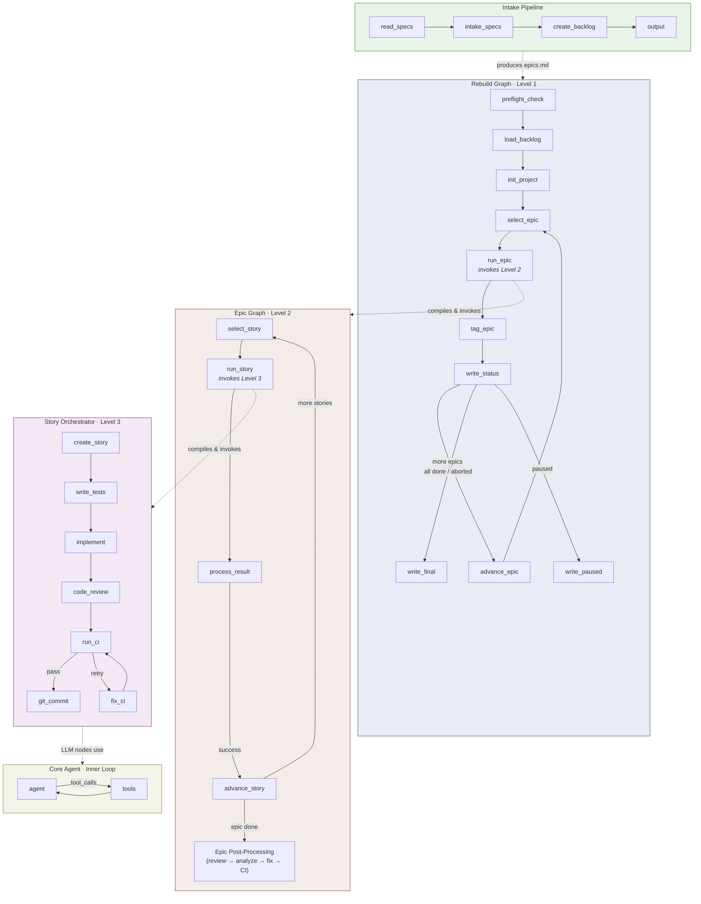
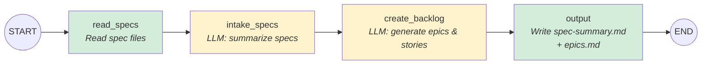
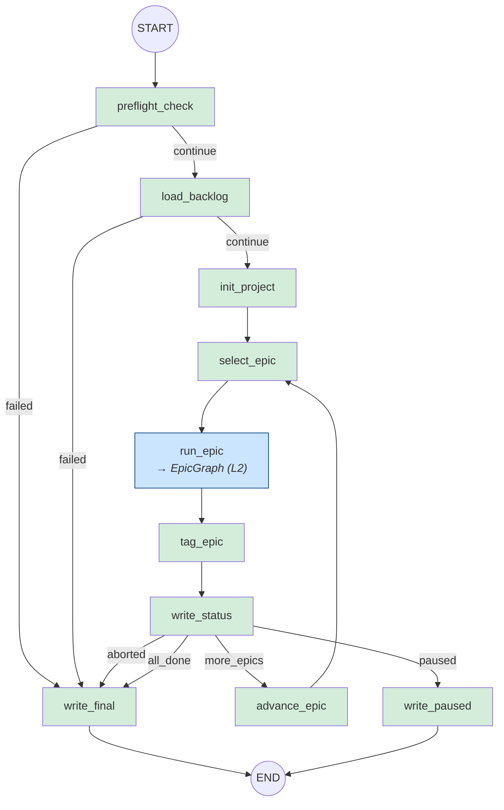
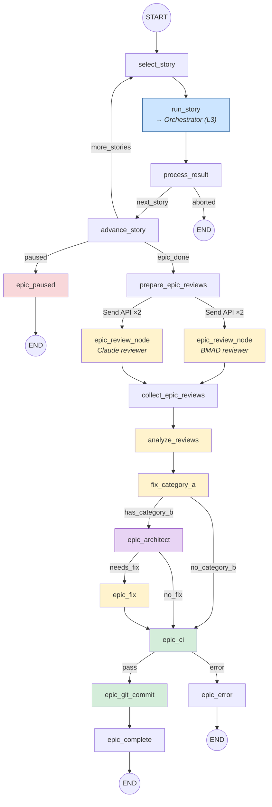
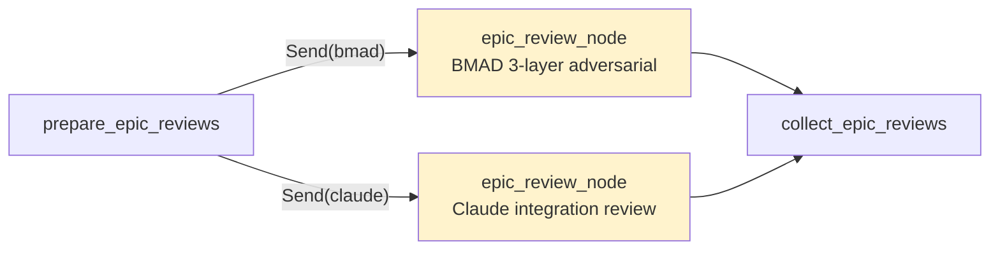
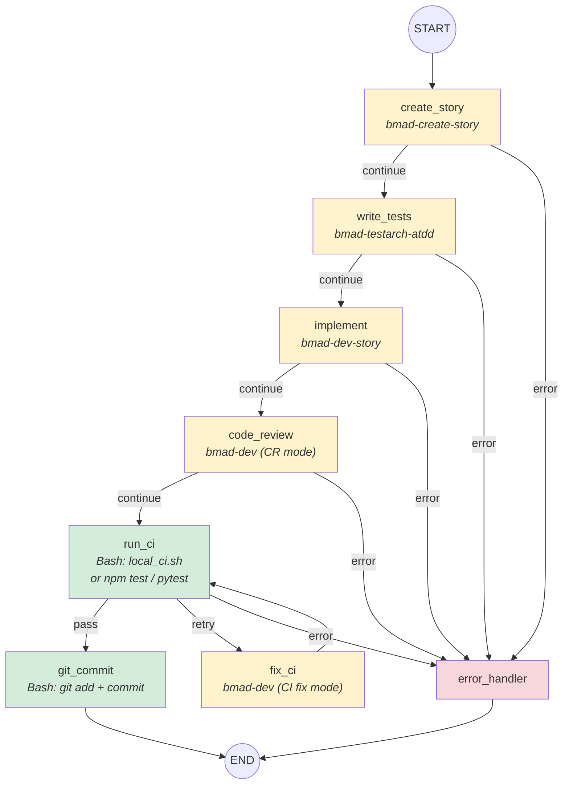
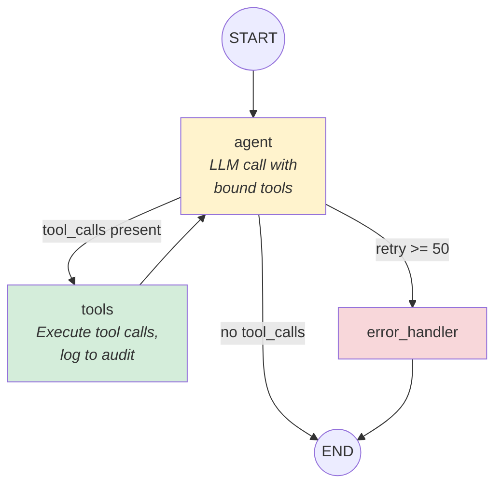

# Shipyard LangGraph Architecture

Shipyard uses a **4-level hierarchical** LangGraph architecture plus a standalone intake pipeline. Each level invokes the next as a wrapper node, enabling epic-scale autonomous code generation with TDD, review, and CI gates.

## Table of Contents

- [System Overview](#system-overview)
- [1. Intake Pipeline](#1-intake-pipeline)
- [2. Rebuild Graph (Level 1)](#2-rebuild-graph-level-1)
- [3. Epic Graph (Level 2)](#3-epic-graph-level-2)
- [4. Story Orchestrator (Level 3)](#4-story-orchestrator-level-3)
- [5. Core Agent (Inner Loop)](#5-core-agent-inner-loop)

## System Overview

The overview shows how each graph nests inside the one above it. Solid borders are LangGraph StateGraphs; dashed borders are compiled subgraph invocations.

## 1. Intake Pipeline

**Source:** `src/intake/pipeline.py`

A linear, no-retry pipeline that reads project specs and produces `spec-summary.md` and `epics.md`. No checkpointing.

**Node types:** Green = Bash/IO, Yellow = LLM (spawns Core Agent via `run_sub_agent`)

## 2. Rebuild Graph (Level 1)

**Source:** `src/intake/rebuild_graph.py`
**Checkpointing:** SQLite at `checkpoints/rebuild.db`

Outer loop that iterates through epics. Supports pause/resume via signal handler and `checkpoints/session.json`.

**Legend:** Blue = wrapper node (invokes subgraph), Green = Bash/logic

**Routing functions:**

- `route_after_load_backlog` — checks `pipeline_status == "failed"` (reused for both preflight and load_backlog)
- `route_after_epic` — checks epic status, pause signal, and remaining epics

## 3. Epic Graph (Level 2)

**Source:** `src/intake/epic_graph.py`
**Special features:** LangGraph `Send` API for parallel fan-out, `interrupt()` for human-in-the-loop

The most complex graph. Two distinct phases: a story iteration loop, then epic-level post-processing with dual-track code review.

**Legend:** Blue = wrapper node (invokes subgraph), Yellow = LLM agent, Purple = Architect (Opus model), Green = Bash, Red = terminal/pause

**Routing functions:**

- `route_after_story_result` — completed → next_story, failed → aborted
- `route_next_story` — checks pause signal, remaining stories
- `route_to_epic_reviewers` — returns `Send()` list for parallel fan-out
- `route_after_category_a` — Category B items exist?
- `route_after_epic_architect` — fixes needed?
- `route_after_epic_ci` — pass or error

**Parallel review via Send API:**

## 4. Story Orchestrator (Level 3)

**Source:** `src/multi_agent/orchestrator.py`
**Retry limits:** MAX_CI_CYCLES = 4

The per-story TDD pipeline. Each LLM node invokes a specific BMAD agent via `invoke_bmad_agent()`. Bash nodes run tests and CI without LLM involvement.

**Legend:** Yellow = LLM (BMAD agent), Green = Bash (no LLM), Red = error terminal

**Routing functions:**

- `route_after_llm_node` — checks `pipeline_status == "failed"` (reused for all LLM nodes)
- `route_after_ci` — pass / retry (if under MAX_CI_CYCLES) / error

**Tool scoping per phase:**

| Node | BMAD Agent | Tool Set |
|------|-----------|----------|
| create_story | bmad-create-story | TOOLS_SM |
| write_tests | bmad-testarch-atdd | TOOLS_TEA |
| implement | bmad-dev-story | TOOLS_DEV |
| code_review | bmad-dev | TOOLS_CODE_REVIEW |
| fix_ci | bmad-dev | TOOLS_CI_FIX |

## 5. Core Agent (Inner Loop)

**Source:** `src/agent/graph.py`
**Checkpointing:** SQLite at `checkpoints/shipyard.db`

The foundational ReAct loop. Called by BMAD agent invocations in the orchestrator and by `run_sub_agent()` in the intake pipeline.

**Routing function:** `should_continue` — checks for tool_calls (→ tools), retry limit exceeded (→ error), or completion (→ end)
