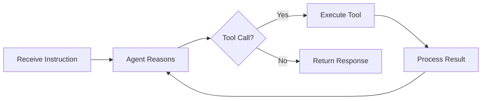
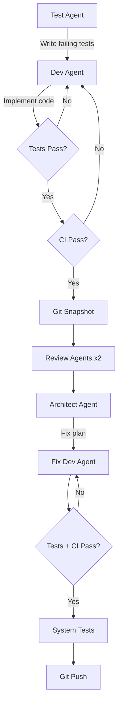

# Shipyard User's Guide

Multi-agent coding assistant powered by LangGraph and Claude. Shipyard orchestrates specialized AI agents — Dev, Test, Reviewer, Architect — to analyze, review, and modify codebases through a structured TDD pipeline.

## Prerequisites

- Python 3.13+
- [Anthropic API key](https://console.anthropic.com/)
- [LangSmith API key](https://smith.langchain.com/) for tracing
- Docker (optional, for containerized deployment)

## Installation

### Clone and Set Up

```bash
git clone https://github.com/dmalcorn/shipyard.git shipyard
cd shipyard
python -m venv .venv
source .venv/bin/activate   # Windows: .venv\Scripts\activate
pip install -r requirements.txt
pip install -r requirements-dev.txt
```

### Configure Environment

```bash
cp .env.example .env
```

Edit `.env` and fill in your API keys:

| Variable | Required | Purpose |
|----------|----------|---------|
| `ANTHROPIC_API_KEY` | Yes | Claude model access |
| `LANGCHAIN_TRACING_V2` | No | Set `true` to enable LangSmith tracing |
| `LANGCHAIN_API_KEY` | If tracing | LangSmith trace collection |
| `LANGCHAIN_PROJECT` | If tracing | Project name for trace grouping (default: `shipyard`) |

## Running Shipyard

Shipyard supports three modes: interactive CLI, HTTP API server, and Docker.

### CLI Mode

Start an interactive session:

```bash
python -m src.main --cli
```

```
Shipyard CLI (session: abc-123)
Type "exit" or "quit" to stop.

>>> Read the README.md file
[Agent reads the file and returns its contents]

>>> Review src/main.py for code quality issues
[Agent dispatches reviewer agents and returns findings]

>>> exit
Goodbye.
```

Your session persists across instructions — you can issue multiple commands without restarting.

### Server Mode

Launch the FastAPI server:

```bash
uvicorn src.main:app --reload --port 8000
```

Or with built-in options:

```bash
python -m src.main --host 0.0.0.0 --port 8000 --reload
```

### Docker

```bash
docker compose up
```

The server is available at `http://localhost:8000`.

### Cloud Deployment (Railway)

Shipyard is deployed on Railway at:

**https://shipyard-production-29ae.up.railway.app/**

The Dockerfile builds and deploys automatically when you push to the `main` branch on GitHub. Railway injects the `PORT` environment variable — the Dockerfile CMD uses `${PORT:-8000}` to respect it.

Required environment variables (set in Railway dashboard):

| Variable | Purpose |
|----------|---------|
| `ANTHROPIC_API_KEY` | Claude model access |
| `LANGCHAIN_TRACING_V2` | `true` to enable LangSmith tracing |
| `LANGCHAIN_API_KEY` | LangSmith trace collection |
| `LANGCHAIN_PROJECT` | Project name for traces |

## Web Dashboard

Visiting the root URL (`/`) serves an interactive **Command Bridge** dashboard with four panels:

- **Health Status** — header badge polls `GET /health` every 30 seconds (green = nominal, red = offline)
- **Agent Terminal** — send instructions via `POST /instruct`, view responses with session persistence
- **Spec Intake** — trigger the intake pipeline via `POST /intake` with configurable paths
- **Rebuild Control** — start rebuilds via `POST /rebuild`, view story progress stats, submit interventions

### Pipeline Flow Graph

The bottom of the dashboard displays a live **Pipeline Flow** visualization showing all three pipelines:

- **Instruct**: User Input → Agent Node → Should Continue? → Tool Calls → Response
- **Intake**: Read Specs → Summarize → Gen Backlog → Write Output → Complete
- **Rebuild**: Load Backlog → Init Project → [TDD → Test → Review → Git Tag] → Complete

Flow nodes are driven by **real server-side state** — the dashboard polls `GET /pipeline/{session_id}/stage` every 15 seconds while a pipeline is running. Nodes light up amber (active), green (completed), or red (failed). The rebuild lane includes a dashed "per story" bracket showing which story is currently being processed.

## API Reference

### `GET /health`

Health check. Returns `{"status": "ok"}`.

### `GET /pipeline/{session_id}/stage`

Poll the current stage of a running pipeline. Used by the dashboard flow graph.

**Response (running):**

```json
{
  "pipeline": "intake",
  "stage": "summarizing",
  "stage_index": 1,
  "total_stages": 5,
  "stages": ["reading_specs", "summarizing", "generating_backlog", "writing_output", "complete"],
  "status": "running",
  "error": "",
  "story_progress": {},
  "elapsed_seconds": 12.3
}
```

For rebuild pipelines, `story_progress` includes the current epic, story name, and index.

**Response (unknown session):**

```json
{"status": "unknown", "error": "No such session"}
```

### `POST /instruct`

Send a single instruction to the agent.

```bash
curl -X POST http://localhost:8000/instruct \
  -H "Content-Type: application/json" \
  -d '{"message": "Read the README.md file"}'
```

**Request body:**

| Field | Type | Required | Description |
|-------|------|----------|-------------|
| `message` | string | Yes | The instruction for the agent |
| `session_id` | string | No | Reuse a session for multi-turn conversations |

**Response:**

```json
{
  "session_id": "uuid",
  "response": "Agent's text response",
  "messages_count": 5
}
```

### `POST /intake`

Run the specification intake pipeline to generate a backlog from project documentation.

**Request body:**

| Field | Type | Required | Description |
|-------|------|----------|-------------|
| `spec_dir` | string | Yes | Path to a directory containing spec files (`.md`, `.txt`) |
| `target_dir` | string | No | Output directory (default: `./target/`) |
| `session_id` | string | No | Session identifier |

**Response:**

```json
{
  "session_id": "uuid",
  "pipeline_status": "completed",
  "output_dir": "./target/",
  "error": ""
}
```

On success, the pipeline writes `spec-summary.md` and `epics.md` to the output directory.

### `POST /rebuild`

Run the autonomous rebuild loop on a target project using a previously generated backlog.

**Request body:**

| Field | Type | Required | Description |
|-------|------|----------|-------------|
| `target_dir` | string | Yes | Path to the target project with `epics.md` |
| `session_id` | string | No | Session identifier |

**Response:**

```json
{
  "session_id": "uuid",
  "stories_completed": 8,
  "stories_failed": 1,
  "interventions": 2,
  "total_stories": 9,
  "status": "partial"
}
```

### `POST /rebuild/intervene`

Submit a human intervention during an active rebuild session when the pipeline encounters a failure it cannot recover from.

**Request body:**

| Field | Type | Required | Description |
|-------|------|----------|-------------|
| `session_id` | string | Yes | Active rebuild session ID |
| `what_broke` | string | Yes | Description of the failure |
| `what_developer_did` | string | Yes | What you did to fix it |
| `agent_limitation` | string | Yes | Why the agent could not handle it |
| `action` | string | Yes | One of: `fix`, `skip`, `abort` |

## CLI Pipelines

### Intake Pipeline

Parse project specifications and generate a structured backlog:

```bash
python -m src.main --intake /path/to/specs --target-dir ./target/
```

This reads all `.md` and `.txt` files from the spec directory, summarizes them, and produces:

- `spec-summary.md` — structured overview of features, tech stack, and acceptance criteria
- `epics.md` — epics and user stories in BDD format

### Autonomous Rebuild

Rebuild a project from a generated backlog:

```bash
python -m src.main --rebuild ./target/
```

The rebuild loop:

1. Loads the backlog from `epics.md`
2. Initializes the target project (git repo, scaffold)
3. Processes each story through the TDD pipeline
4. Tracks progress in `rebuild-status.md`
5. Prompts for human intervention on failures (CLI mode)
6. Produces `intervention-log.md` documenting every manual fix

## How the Agent Works

### Core Loop

Shipyard uses a LangGraph state machine with a ReAct (Reasoning + Acting) pattern:



Session state is checkpointed to SQLite after every step, so conversations survive restarts.

### Agent Roles

Shipyard uses specialized agents with different permissions and model tiers:

| Role | Model | Capabilities |
|------|-------|-------------|
| **Dev** | Sonnet | Full read/write/edit access, bash execution |
| **Test** | Sonnet | Read all files, write only to `tests/`, bash execution |
| **Reviewer** | Sonnet | Read-only source code, write findings to `reviews/` |
| **Architect** | Opus | Reads reviews, writes fix plans and architectural decisions |
| **Fix Dev** | Sonnet | Fresh agent that executes architect-approved fixes |

### TDD Pipeline

For multi-agent story execution, Shipyard follows a structured pipeline:



### Available Tools

All tools return `SUCCESS:` or `ERROR:` prefixed strings — exceptions are caught internally, never raised.

| Tool | Purpose |
|------|---------|
| `read_file` | Read file contents |
| `edit_file` | Surgical string replacement (exact match, must be unique) |
| `write_file` | Create or overwrite a file |
| `list_files` | Glob pattern file search |
| `search_files` | Regex content search |
| `run_command` | Execute a shell command with timeout |

**Edit tool behavior:** The edit tool reads the file, counts occurrences of the target string, and only performs the replacement if there is exactly one match. Zero matches or multiple matches produce an explicit error — no silent corruption.

### Context Injection

Shipyard uses a three-layer context injection system to give agents the right information:

- **Layer 1 (always-present):** Role description and coding standards, included in every agent's system prompt
- **Layer 2 (task-specific):** Files passed with the instruction, read and prepended to the message
- **Layer 3 (on-demand):** Agents use read/search/glob tools to explore the codebase during execution

### File-Based Agent Communication

Agents coordinate through markdown files with YAML frontmatter rather than shared memory. Each agent writes structured output (reviews, fix plans, specs) to the filesystem, and downstream agents read those files as input. This enables parallel execution and full auditability.

## Observability

### LangSmith Tracing

When `LANGCHAIN_TRACING_V2=true`, every LLM call, tool invocation, and agent decision is automatically traced to LangSmith with metadata:

- `agent_role` — dev, test, reviewer, architect, fix_dev
- `task_id` — unique task identifier
- `model_tier` — haiku, sonnet, opus
- `phase` — test, implementation, review, fix, ci, architect
- `parent_session` — links sub-agents to their parent

### Markdown Audit Logs

Every session produces a markdown log at `logs/session-{session_id}.md` with a tree-style trace:

```
[Session abc-123] 2026-03-24T10:30:00 — Task: "Read the README"

|- [dev - claude-sonnet-4-6] Started
|  |- read_file: README.md (SUCCESS)
|  |- edit_file: src/main.py (SUCCESS)
|  +- Done

+- [Session Complete] Total: 1 agents, 0 scripts, 2 files touched
```

These logs are available without LangSmith — a portable, self-contained audit trail.

## Development

### Run Tests

```bash
pytest tests/ -v
```

### Lint and Type Check

```bash
ruff check src/ tests/
ruff format --check src/ tests/
mypy src/
```

### Local CI

Run all checks in sequence:

```bash
bash scripts/local_ci.sh
```

All three (ruff, mypy, pytest) must pass before committing.

## Project Structure

```
shipyard/
+-- src/
|   +-- main.py              # FastAPI server + CLI entry point
|   +-- pipeline_tracker.py  # In-memory pipeline stage tracker
|   +-- agent/               # LangGraph graph, state, prompts
|   +-- tools/               # File ops, search, execution tools
|   +-- context/             # Context injection system
|   +-- audit_log/           # LangSmith tracing + audit logger
|   +-- multi_agent/         # Sub-agent spawning + orchestration
|   +-- intake/              # Spec intake + autonomous rebuild
|   +-- static/              # Web dashboard (index.html)
+-- tests/                   # Test suite (mirrors src/ structure)
+-- scripts/                 # CI, testing, and git helper scripts
+-- coding-standards.md      # Conventions enforced by all agents
+-- .env.example             # Environment variable template
+-- Dockerfile               # Container image
+-- docker-compose.yml       # Local containerized deployment
+-- checkpoints/             # SQLite session state (git-ignored)
+-- logs/                    # Audit logs (git-ignored)
```
