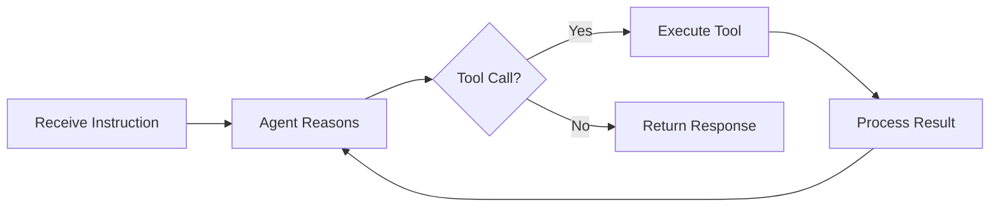
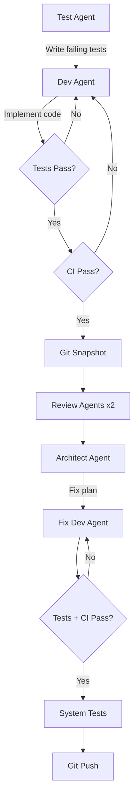

# Shipyard User's Guide

Multi-agent coding assistant powered by LangGraph and Claude. Shipyard orchestrates specialized AI agents — Dev, Test, Reviewer, Architect — to analyze, review, and modify codebases through a structured TDD pipeline.

## Prerequisites

- Python 3.13+
- [Anthropic API key](https://console.anthropic.com/)
- [LangSmith API key](https://smith.langchain.com/) for tracing
- Docker (optional, for containerized deployment)

## Installation

### Clone and Set Up

```bash
git clone https://github.com/dmalcorn/shipyard.git shipyard
cd shipyard
python -m venv .venv
source .venv/bin/activate   # Windows: .venv\Scripts\activate
pip install -r requirements.txt
pip install -r requirements-dev.txt
```

### Configure Environment

```bash
cp .env.example .env
```

Edit `.env` and fill in your API keys:

| Variable | Required | Purpose |
|----------|----------|---------|
| `ANTHROPIC_API_KEY` | Yes | Claude model access |
| `LANGCHAIN_TRACING_V2` | No | Set `true` to enable LangSmith tracing |
| `LANGCHAIN_API_KEY` | If tracing | LangSmith trace collection |
| `LANGCHAIN_PROJECT` | If tracing | Project name for trace grouping (default: `shipyard`) |
| `SHIPYARD_RELAY_URL` | No | Public dashboard relay endpoint (e.g. Railway URL) |
| `SHIPYARD_RELAY_KEY` | If relay | Shared secret for authenticating relay pushes |

## Running Shipyard

Shipyard supports three modes: interactive CLI, HTTP API server, and Docker.

### CLI Mode

Start an interactive session:

```bash
python -m src.main --cli
```

```
Shipyard CLI (session: abc-123)
Type "exit" or "quit" to stop.

>>> Read the README.md file
[Agent reads the file and returns its contents]

>>> Review src/main.py for code quality issues
[Agent dispatches reviewer agents and returns findings]

>>> exit
Goodbye.
```

Your session persists across instructions — you can issue multiple commands without restarting.

### Server Mode

Launch the FastAPI server:

```bash
uvicorn src.main:app --reload --port 8000
```

Or with built-in options:

```bash
python -m src.main --host 0.0.0.0 --port 8000 --reload
```

### Docker

**Standard server:**

```bash
docker compose up
```

The server is available at `http://localhost:8000`.

**Rebuild container** — runs the rebuild pipeline with the target project mounted as a volume:

```bash
docker compose -f docker-compose.rebuild.yml up
```

The rebuild container mounts `../testdir` as `/app/workspace` and your Claude CLI config for OAuth authentication. Edit `docker-compose.rebuild.yml` to change the target project path or credentials mount.

### Cloud Deployment (Railway)

Shipyard is deployed on Railway at:

**https://shipyard-production-29ae.up.railway.app/**

The Dockerfile builds and deploys automatically when you push to the `main` branch on GitHub. Railway injects the `PORT` environment variable — the Dockerfile CMD uses `${PORT:-8000}` to respect it.

Required environment variables (set in Railway dashboard):

| Variable | Purpose |
|----------|---------|
| `ANTHROPIC_API_KEY` | Claude model access |
| `LANGCHAIN_TRACING_V2` | `true` to enable LangSmith tracing |
| `LANGCHAIN_API_KEY` | LangSmith trace collection |
| `LANGCHAIN_PROJECT` | Project name for traces |
| `DATABASE_URL` | Postgres connection string for log relay storage |
| `SHIPYARD_RELAY_KEY` | Shared secret for relay authentication |

## Web Dashboard

Visiting the root URL (`/`) serves an interactive **Command Bridge** dashboard with four panels:

- **Health Status** — header badge polls `GET /health` every 30 seconds (green = nominal, red = offline)
- **Agent Terminal** — send instructions via `POST /instruct`, view responses with session persistence
- **Spec Intake** — trigger the intake pipeline via `POST /intake` with configurable paths
- **Rebuild Control** — start rebuilds via `POST /rebuild`, view story progress stats, submit interventions

### Pipeline Flow Graph

The bottom of the dashboard displays a live **Pipeline Flow** visualization showing all three pipelines:

- **Instruct**: User Input → Agent Node → Should Continue? → Tool Calls → Response
- **Intake**: Read Specs → Summarize → Gen Backlog → Write Output → Complete
- **Rebuild**: Load Backlog → Init Project → [TDD → Test → Review → Git Tag] → Complete

Flow nodes are driven by **real server-side state** — the dashboard polls `GET /pipeline/{session_id}/stage` every 15 seconds while a pipeline is running. Nodes light up amber (active), green (completed), or red (failed). The rebuild lane includes a dashed "per story" bracket showing which story is currently being processed.

### Public Monitoring Dashboard

When `DATABASE_URL` and `SHIPYARD_RELAY_URL` are configured, the pipeline streams real-time log output to the Railway-hosted dashboard via Postgres. The monitoring API endpoints (`/api/sessions`, `/api/logs/{session_id}`, `/api/stream/{session_id}`) are public read-only. Log events are pushed from the local pipeline runner using the authenticated `/api/events` endpoint.

## API Reference

### `GET /health`

Health check. Returns `{"status": "ok"}`.

### `GET /pipeline/{session_id}/stage`

Poll the current stage of a running pipeline. Used by the dashboard flow graph.

**Response (running):**

```json
{
  "pipeline": "intake",
  "stage": "summarizing",
  "stage_index": 1,
  "total_stages": 5,
  "stages": ["reading_specs", "summarizing", "generating_backlog", "writing_output", "complete"],
  "status": "running",
  "error": "",
  "story_progress": {},
  "elapsed_seconds": 12.3
}
```

For rebuild pipelines, `story_progress` includes the current epic, story name, and index.

**Response (unknown session):**

```json
{"status": "unknown", "error": "No such session"}
```

### `POST /instruct`

Send a single instruction to the agent.

```bash
curl -X POST http://localhost:8000/instruct \
  -H "Content-Type: application/json" \
  -d '{"message": "Read the README.md file"}'
```

**Request body:**

| Field | Type | Required | Description |
|-------|------|----------|-------------|
| `message` | string | Yes | The instruction for the agent |
| `session_id` | string | No | Reuse a session for multi-turn conversations |

**Response:**

```json
{
  "session_id": "uuid",
  "response": "Agent's text response",
  "messages_count": 5
}
```

### `POST /intake`

Run the specification intake pipeline to generate a backlog from project documentation.

**Request body:**

| Field | Type | Required | Description |
|-------|------|----------|-------------|
| `spec_dir` | string | Yes | Path to a directory containing spec files (`.md`, `.txt`) |
| `target_dir` | string | No | Output directory (default: `./target/`) |
| `session_id` | string | No | Session identifier |

**Response:**

```json
{
  "session_id": "uuid",
  "pipeline_status": "completed",
  "output_dir": "./target/",
  "error": ""
}
```

On success, the pipeline writes `spec-summary.md` and `epics.md` to the output directory.

### `POST /rebuild`

Run the autonomous rebuild loop on a target project using a previously generated backlog.

**Request body:**

| Field | Type | Required | Description |
|-------|------|----------|-------------|
| `target_dir` | string | Yes | Path to the target project with `epics.md`. Must be outside Shipyard's tree. Relative paths are resolved to absolute. |
| `session_id` | string | No | Session identifier |

**Response:**

```json
{
  "session_id": "uuid",
  "stories_completed": 8,
  "stories_failed": 1,
  "interventions": 2,
  "total_stories": 9,
  "status": "partial"
}
```

### `POST /rebuild/intervene`

Submit a human intervention during an active rebuild session when the pipeline encounters a failure it cannot recover from.

**Request body:**

| Field | Type | Required | Description |
|-------|------|----------|-------------|
| `session_id` | string | Yes | Active rebuild session ID |
| `what_broke` | string | Yes | Description of the failure |
| `what_developer_did` | string | Yes | What you did to fix it |
| `agent_limitation` | string | Yes | Why the agent could not handle it |
| `action` | string | Yes | One of: `fix`, `skip`, `abort` |

### Monitoring API (Relay Endpoints)

These endpoints power the public monitoring dashboard. Write endpoints require `Authorization: Bearer <SHIPYARD_RELAY_KEY>`. Read endpoints are public.

| Endpoint | Method | Auth | Description |
|----------|--------|------|-------------|
| `/api/sessions/start` | POST | Yes | Register a new pipeline session |
| `/api/sessions/end` | POST | Yes | Mark a session as completed/failed |
| `/api/events` | POST | Yes | Push log events from local pipeline |
| `/api/sessions` | GET | No | List recent pipeline sessions |
| `/api/active` | GET | No | Get the currently running session |
| `/api/logs/{session_id}` | GET | No | Fetch log events (supports `?after_id=N` for incremental polling) |
| `/api/stream/{session_id}` | GET | No | SSE stream of live log events |

## CLI Pipelines

### Intake Pipeline

Parse project specifications and generate a structured backlog:

```bash
python -m src.main --intake /path/to/specs --target-dir ./target/
```

This reads all `.md` and `.txt` files from the spec directory, summarizes them, and produces:

- `spec-summary.md` — structured overview of features, tech stack, and acceptance criteria
- `epics.md` — epics and user stories in BDD format

### Autonomous Rebuild

Rebuild a project from a generated backlog:

```bash
python -m src.main --rebuild ./target/
```

The rebuild loop:

1. Loads the backlog from `epics.md`
2. Initializes the target project (git repo, scaffold)
3. Processes each story through the TDD pipeline
4. Tracks progress in `rebuild-status.md`
5. Prompts for human intervention on failures (CLI mode)
6. Produces `intervention-log.md` documenting every manual fix

#### Pause and Resume

Press **Ctrl+C once** during a rebuild to request a graceful pause. The pipeline finishes the current story, saves checkpoint state to `checkpoints/session.json`, and exits with a "paused" status. Press Ctrl+C twice to force-quit immediately.

Resume from where you left off:

```bash
python -m src.main --rebuild ./target/ --resume
```

Resume reloads the session ID and skips already-completed epics/stories.

#### Recovering from an Abort

When a story fails and the pipeline cannot recover (retry limits exceeded, or a fundamental issue the agents cannot fix), the epic aborts and the pipeline terminates. Unlike a graceful pause (Ctrl+C), an abort does **not** write resume state to `checkpoints/session.json` — so `--resume` will not work out of the box.

**Step 1: Diagnose the failure**

Check these files in the target project directory:

- `rebuild-status.md` — shows which stories completed and which failed
- `intervention-log.md` — if any interventions were attempted before the abort
- Console output — the pipeline prints `STORY RESULT: {id} — failed` and error details

The audit logs at `logs/session-{session_id}.md` in the Shipyard directory contain the full agent trace for the failed story.

**Step 2: Fix the issue in the target project**

Navigate to the target directory and fix the problem manually. Common fixes include correcting test expectations, fixing imports, resolving dependency issues, or adjusting code that the agents generated incorrectly. Commit your fix so it is preserved:

```bash
cd /path/to/target
# make your fix
git add -A && git commit -m "manual fix: describe what you fixed"
```

**Step 3: Create resume state manually**

Since the abort did not save resume state, create or edit `checkpoints/session.json` to tell the pipeline where to pick up. You need the `session_id` from the aborted run (printed in the console output) and the epic index to resume from.

```bash
# Find your session ID from the console output or session file
cat checkpoints/session.json
```

Write the resume state:

```json
{
  "session_id": "your-session-id-here",
  "target_dir": "/path/to/target",
  "resume_epic_index": 2,
  "resume_stories_completed": 5,
  "resume_stories_failed": 0,
  "resume_total_interventions": 0,
  "resume_story_results": []
}
```

Key fields:

| Field | How to set it |
|-------|--------------|
| `resume_epic_index` | The index (0-based) of the epic to resume from. If story 3.2 in Epic 3 failed and Epic 3 is at index 2, set this to `2` to re-run Epic 3 from the beginning. Set to `3` to skip Epic 3 entirely and start Epic 4. |
| `resume_stories_completed` | Count of stories that completed successfully before the abort (from `rebuild-status.md`). |
| `resume_stories_failed` | Set to `0` for a clean restart of the remaining epics. |
| `resume_story_results` | Set to `[]` or copy the results array from the previous `rebuild-status.md` if you want to preserve history. |

**Step 4: Resume the pipeline**

```bash
python -m src.main --rebuild /path/to/target --resume
```

The pipeline reloads the backlog, skips to the specified epic index, and continues from there.

**Important:** Resume skips entire **epics**, not individual stories. If Epic 3 failed on story 3.4, resuming at epic index 2 re-runs all of Epic 3 from story 3.1. Already-committed stories are re-attempted by the agents (the TDD pipeline does not check for prior git commits), but they generally succeed quickly since the code and tests already exist.

**Alternative: Start fresh**

If the failure is early in the pipeline or you prefer a clean run, delete the checkpoint state and re-run:

```bash
rm checkpoints/session.json
python -m src.main --rebuild /path/to/target
```

The pipeline starts from Epic 1, Story 1. Previously committed stories will be re-processed by the agents.

#### Cost Tracking

The rebuild pipeline tracks cumulative LLM costs and invocation counts. At the end of a run (or pause), the CLI prints:

```
Cost: $12.34 (87 LLM calls)
```

#### Target Directory Rules

The `target_dir` must point to a directory **outside** Shipyard's own source tree. All agent operations — file reads/writes, bash commands (pytest, ruff, git), and tool executions — are scoped to this directory during a rebuild. This prevents agents from accidentally modifying Shipyard itself.

- **Absolute paths** are used as-is: `--rebuild /home/user/myproject`
- **Relative paths** are resolved to absolute before the pipeline starts: `--rebuild ./target/` becomes `/full/path/to/target/`
- The target directory does not need to exist beforehand — Shipyard creates it and initializes a git repo if needed
- Review files (`reviews/`) and git operations all run within the target directory, not Shipyard's working directory

## How the Agent Works

### Core Loop

Shipyard uses a LangGraph state machine with a ReAct (Reasoning + Acting) pattern:



Session state is checkpointed to SQLite after every step, so conversations survive restarts.

### Agent Roles

Shipyard uses specialized agents with different permissions and model tiers:

| Role | Model | Capabilities |
|------|-------|-------------|
| **Dev** | Sonnet | Full read/write/edit access, bash execution |
| **Test** | Sonnet | Read all files, write only to `tests/`, bash execution |
| **Reviewer** | Sonnet | Read-only source code, write findings to `reviews/` |
| **Architect** | Opus | Reads reviews, writes fix plans to `reviews/` and `fix-plan.md` |
| **Fix Dev** | Sonnet | Fresh agent that executes architect-approved fixes |

### Rebuild Graph Architecture

The rebuild pipeline uses a three-level LangGraph hierarchy:

- **Level 1 — Rebuild Graph** (`rebuild_graph.py`): Outer loop that iterates through epics, handles pause/resume checkpointing
- **Level 2 — Epic Graph** (`epic_graph.py`): Iterates through stories within an epic, runs epic post-processing
- **Level 3 — Orchestrator** (`orchestrator.py`): Per-story TDD pipeline (test → implement → CI → review → fix)

### TDD Pipeline

For multi-agent story execution, Shipyard follows a structured pipeline:



### Available Tools

All tools return `SUCCESS:` or `ERROR:` prefixed strings — exceptions are caught internally, never raised.

| Tool | Purpose |
|------|---------|
| `read_file` | Read file contents (truncated at 5000 chars) |
| `edit_file` | Surgical string replacement (exact match, must be unique) |
| `write_file` | Create or overwrite a file |
| `list_files` | Glob pattern file search |
| `search_files` | Regex content search |
| `run_command` | Execute a shell command with timeout (dangerous patterns blocked) |

**Edit tool behavior:** The edit tool reads the file, counts occurrences of the target string, and only performs the replacement if there is exactly one match. Zero matches or multiple matches produce an explicit error — no silent corruption.

**Scoped tools:** During rebuilds, all tools are scoped to the target directory. File paths are resolved relative to the target root, and any path that resolves outside the sandbox is rejected. Role-based write restrictions are enforced on top of the sandbox boundary.

### Context Injection

Shipyard uses a three-layer context injection system to give agents the right information:

- **Layer 1 (always-present):** Role description and coding standards, included in every agent's system prompt
- **Layer 2 (task-specific):** Files passed with the instruction, read and prepended to the message
- **Layer 3 (on-demand):** Agents use read/search/glob tools to explore the codebase during execution

### File-Based Agent Communication

Agents coordinate through markdown files with YAML frontmatter rather than shared memory. Each agent writes structured output (reviews, fix plans, specs) to the filesystem, and downstream agents read those files as input. This enables parallel execution and full auditability.

## Observability

### LangSmith Tracing

When `LANGCHAIN_TRACING_V2=true`, every LLM call, tool invocation, and agent decision is automatically traced to LangSmith with metadata:

- `agent_role` — dev, test, reviewer, architect, fix_dev
- `task_id` — unique task identifier
- `model_tier` — haiku, sonnet, opus
- `phase` — test, implementation, review, fix, ci, architect, post_fix_test, post_fix_ci
- `parent_session` — links sub-agents to their parent

### Markdown Audit Logs

Every session produces a markdown log at `logs/session-{session_id}.md` with a tree-style trace:

```
[Session abc-123] 2026-03-24T10:30:00 — Task: "Read the README"

|- [dev - claude-sonnet-4-6] Started
|  |- read_file: README.md (SUCCESS)
|  |- edit_file: src/main.py (SUCCESS)
|  +- Done

+- [Session Complete] Total: 1 agents, 0 scripts, 2 files touched
```

These logs are available without LangSmith — a portable, self-contained audit trail.

### Web Relay

When `SHIPYARD_RELAY_URL` and `SHIPYARD_RELAY_KEY` are set, the rebuild pipeline pushes real-time log events to the Railway-hosted server. The relay intercepts both `print()` output and Python `logging` output, batching events and pushing them to `/api/events`. The public dashboard streams these events via SSE at `/api/stream/{session_id}`.

## Development

### Run Tests

```bash
pytest tests/ -v
```

### Lint and Type Check

```bash
ruff check src/ tests/
ruff format --check src/ tests/
mypy src/
```

### Local CI

Run all checks in sequence:

```bash
bash scripts/local_ci.sh
```

All three (ruff, mypy, pytest) must pass before committing.

## Project Structure

```
shipyard/
├── src/
│   ├── main.py              # FastAPI server + CLI entry point
│   ├── pipeline_tracker.py  # In-memory pipeline stage tracker
│   ├── log_relay.py         # Postgres log relay for dashboard streaming
│   ├── web_relay.py         # Web relay client for pushing events
│   ├── agent/               # LangGraph graph, state, prompts
│   ├── tools/               # File ops, search, execution tools
│   │   ├── scoped.py        # Working-directory-scoped tools for rebuilds
│   │   └── restricted.py    # Role-based write restrictions
│   ├── context/             # Context injection system
│   ├── audit_log/           # Structured audit logger
│   ├── multi_agent/         # Sub-agent spawning + orchestration
│   │   ├── orchestrator.py  # Per-story TDD pipeline (Level 3)
│   │   ├── spawn.py         # Agent spawning via Claude CLI
│   │   ├── bmad_invoke.py   # BMAD agent invocations
│   │   └── roles.py         # Agent role definitions + tool permissions
│   ├── intake/              # Spec intake + autonomous rebuild
│   │   ├── rebuild.py       # Rebuild entry point + relay wiring
│   │   ├── rebuild_graph.py # Level 1: epic loop graph
│   │   ├── epic_graph.py    # Level 2: story loop graph
│   │   ├── pipeline.py      # Intake pipeline
│   │   ├── backlog.py       # Backlog parser (epics.md)
│   │   ├── cost_tracker.py  # LLM cost accumulator
│   │   ├── pause.py         # Graceful pause/resume flag
│   │   └── intervention_log.py  # Human intervention tracking
│   └── static/              # Web dashboard (index.html)
├── tests/                   # Test suite (mirrors src/ structure)
├── scripts/                 # CI, testing, and git helper scripts
├── coding-standards.md      # Conventions enforced by all agents
├── .env.example             # Environment variable template
├── Dockerfile               # Server container image
├── Dockerfile.rebuild       # Rebuild pipeline container image
├── docker-compose.yml       # Local server deployment
├── docker-compose.rebuild.yml  # Rebuild pipeline deployment
├── checkpoints/             # SQLite session state (git-ignored)
└── logs/                    # Audit logs (git-ignored)
```
